```{r setup, include=FALSE}
options(htmltools.dir.version = FALSE)
knitr::opts_chunk$set(message=FALSE, warning=FALSE, comment="#",
                      fig.width=4.25, fig.height=3.5, fig.retina=3, dev = "svg")
library(ggplot2)
library(forcats)
library(dplyr)
```


class: inverse, middle, center

.giant[.greenfont[Data structures]]


---

# Wikipedia

.huge[In computer science, a .greenfont[data structure] is a data organization
and storage format that enables efficient access and modification. More precisely,
a data structure is a collection of data values, the relationships among them, 
and the functions or operations that can be applied to the data.]

--

.center[]


???

Source: [Wikipedia](https://en.wikipedia.org/wiki/Data_structure)


---

# Data structure (DS) is hard to learn


.center[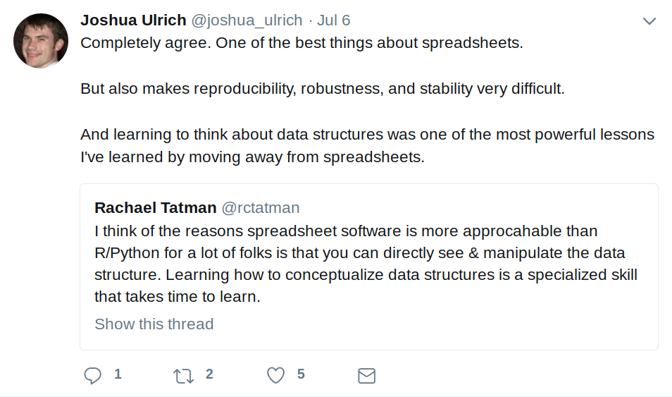]


---

# Data seen by humans


```r
"Good", "Bad", "Ugly", ...

1, 2, 3, 4, ...

1.23, 3.41, 6.09, ...

2018-07-01, 2018-07-02, ...

2018-07-01 12:45:00, 2018-07-02 21:12:40, ...
```

---

# Data understood by computers


```r
11010 1001001 101010 101010
10100 1010101 101010 101010
11110 1101011 101010 100101
11110 1101011 101010 100101
11110 1101011 101010 100101
```

---

# A helicopter view

<br>

<br>

.enormous[DS is a way to .greenfont[organise] and .greenfont[store] 
data that is readable by humans and interpretable by computers.]


---

# DS featured by

<br>

- .enormous[dimensionality]

<br>

- .enormous[type]

---

# R's base DS


```r

|    	|  Same types    	|  Different types 	|
|----	|----------------	|------------------	|
| 1d 	| Atomic vectors 	| List             	|
| 2d 	| Matrix         	| Data frame       	|
| nd 	| Array          	|                  	|
```

???

http://adv-r.had.co.nz/Data-structures.html

---

# R's base DS

.center[]

???

http://venus.ifca.unican.es/Rintro/dataStruct.html

---

# Inspection tools


```r

# `str`ucture?
str()

# what type it is?
typeof()
class()

# how many elements it stores?
length()
dim()

# tell names (if any) of each elements?
names()

```


---
class: inverse, middle, center

.giant[.greenfont[Vectors are everywhere]]


---

```r
logical_vt <- c(TRUE, FALSE, TRUE, FALSE, FALSE, TRUE, TRUE)
integer_vt <- c(1L, 2L, 5L, 4L, 3L)
double_vt <- c(1.23, 3.21, 2.35, 2.4, 2.13, 4.56)
chracter_vt <- c("a", "b", "c", "d", "e", "f", "g", "h")
```

.center[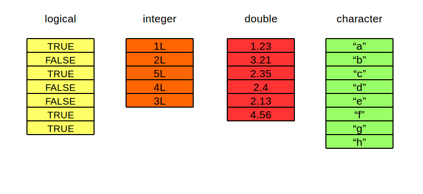]


---

# Atomic vectors are always flat

```{r}
c(1, c(2, c(3, 4)))
```


```{r}
# the same as
c(1, 2, 3, 4)
```


---

# Types and tests

```{r}
logical_vt <- c(TRUE, FALSE, TRUE, FALSE, FALSE, TRUE, TRUE)
integer_vt <- c(1L, 2L, 5L, 4L, 3L)
double_vt <- c(1.23, 3.21, 2.35, 2.4, 2.13, 4.56)
chracter_vt <- c("a", "b", "c", "d", "e", "f", "g", "h")
```

.pull-left[
```{r}
{{typeof(integer_vt)}}

{{typeof(chracter_vt)}}
```
]

.pull-right[
```{r}
{{is.integer(integer_vt)}}

{{is.double(double_vt)}}
```
]

---

# Types and tests

```{r}
logical_vt <- c(TRUE, FALSE, TRUE, FALSE, FALSE, TRUE, TRUE)
integer_vt <- c(1L, 2L, 5L, 4L, 3L)
double_vt <- c(1.23, 3.21, 2.35, 2.4, 2.13, 4.56)
chracter_vt <- c("a", "b", "c", "d", "e", "f", "g", "h")
```

```{r, eval=FALSE}
# other test functions
{{is.numeric()}}

{{is.character()}}

{{is.logical()}}
```


---

# Length and names

```{r}
double_vt <- c(1.23, 3.21, 2.35, 2.4, 2.13, 4.56)
```


```{r}
{{length(double_vt)}}
```

```{r}
{{names(double_vt) <- c("v1", "v2", "v3", "v4", "v5", "v6")}}
```

```{r, echo=FALSE}
double_vt
```

```{r}
{{names(double_vt)}}
```

---

# Vectorization

.huge[Most arithmetic manipulation carried out in vectorized mode:]

```{r}
x <- c(2, 4, 6, 8)
x^2
2 * x + 1
sqrt(x)
```

---

# Recycling rule

.huge[Less obvious case when vectors of different sizes are combined:]

```{r}
c(1, 2, 3, 4) + c(1, 2)
```

--

.center[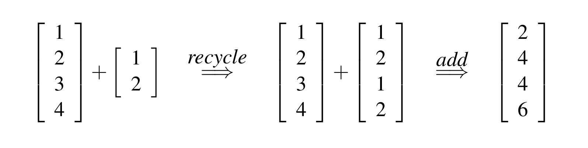]

---

# But

```{r, eval=FALSE}
c(1, 2, 3, 4) + c(1, 2, 3)
```

```
# Warning in c(1, 2, 3, 4) + c(1, 2, 3): longer object length is 
# not a multiple of shorter object length

# [1] 2 4 6 5
```

---

# Sequences

--

.huge[Generate patterned vectors with `n1:n2`]

--

```{r}
1:50
```

```{r}
5:-5
```

---

# General sequences

```r
seq(from, to, by, length)
```

```r
?seq # you have 1 min to read documentaion
```


---

# General sequences

--

```{r}
seq(0, 1, by = .1)
```

--

```{r}
seq(0, 1, length = 11)
```

--

```{r}
seq(0, by = .1, length = 11)
```

--

```{r}
seq(to = 1, by = .1, length = 11)
```


---

# Repeating values

```{r, eval=FALSE}
rep(x, times, each)
```

```{r, eval=FALSE}
?rep # you have 1 min to read documentaion
```


---

# rep() examples

--

```{r}
rep(1:4, times = 3)
```

--

```{r}
rep(1:4, times = c(2, 3, 2, 3))
```

--

```{r}
rep(c("A", "B", "C"), times = 3)
```

---

# rep() examples

--

```{r}
rep(1:4, each = 3)
```

--

```{r}
rep(1:4, rep(3, 4))
```


---

# Your turn

.huge[Create a sequence of perriods as follows:]

```r
"01/2012" "02/2012" "03/2012" "04/2012" "05/2012" "06/2012" 
...
...
...
"07/2018" "08/2018" "09/2018" "10/2018" "11/2018" "12/2018"
```

---

# Solution

```{r, eval=FALSE}
m <- 1:12
m <- ifelse(nchar(m) == 1, paste0("0", m), m)
y <- 2012:2018

paste0(
    rep(m, times = length(y)), "/",
    rep(y, each = 12)
    )
```


---

# Explicit coercion

--

```{r}
x <- c(TRUE, FALSE, TRUE, FALSE, FALSE, TRUE, TRUE)
```

.pull-left[
```{r}
{{y <- as.numeric(x)}}
y
sum(y)
mean(y)
```
]

--

.pull-right[
```{r, eval=FALSE}
# Other coercion functions:
{{as.integer()}}
{{as.logical()}}
{{as.character()}}
```
]

---

# Implicit coercion

--


```{r}
x <- c(TRUE, FALSE, TRUE, FALSE, FALSE, TRUE, TRUE)
```

.pull-left[
```{r}
y <- as.numeric(x)
sum(y)
mean(y)
```
]

--

.pull-right[

.huge[Automatic coercion is a good thing:]

```{r}
{{sum(x)}}
{{mean(x)}}
```
]

---

# Implicit coercion

```{r}
x <- c("a", 1)
str(x)
```

--

.huge[However, it can create surprises:]

```{r}
50 < "7"
```


---

# Implicit coercion

--

```{r}
12 %in% c("as", 12)                  # looks good
```

--

```{r}
"12" %in% c("as", 12)                # not so trivial
```

--

```{r}
12 %in% c("as", "12")                # uhmmmm
```

--

```{r}
"12" %in% c(1, 12)                   # .....
```


---

# Your turn

.huge[Experiment with automatic coercion.]

.huge[What is happening in the following cases?]


```r
sum(c(TRUE, FALSE, TRUE))
c(TRUE, FALSE, TRUE, TRUE, "FALSE")
c(1, 2, 3, 4, FALSE)
c(1, 2, "3", 7, TRUE)
c(10L, 11L, 12)
```

.huge[Can you deduce the R's coercion rule?]

---

# Solution

```{r}
sum(c(TRUE, FALSE, TRUE))
c(TRUE, FALSE, TRUE, TRUE, "FALSE")
c(1, 2, 3, 4, FALSE)
c(1, 2, "3", 7, TRUE)
```

---

# Rule

<br>

- .enormous[Vectors are coerced to the most flexible type.]

<br>

- .enormous[Types from least to most flexible are: `logical` < `integer` < `double` < `character`]

---

# Wrap-up

--

<br>

- .enormous[All elements of an atomic vector must be the same type.]

--

<br>

- .enormous[Coercion often happens automatically.]

--

<br>

- .enormous[When in doubt, do coercion explicitly.]

---

# Recall


.superenormous[.center[.greenfont[Inspect]]]

<br>

.superenormous[.center[.grayfont[Query]]]

<br>

.superenormous[.center[.grayfont[Modify]]]

---

# Next


.superenormous[.center[.grayfont[Inspect]]]

<br>

.superenormous[.center[.greenfont[Query]]]

<br>

.superenormous[.center[.greenfont[Modify]]]


---

# Your turn

.huge[Create two vectors:]

```{r}
set.seed(12)
x <- sample(1:10)
y <- x
names(y) <- c("a", "b", "c", "d", "e", "f", "g", "h", "i", "j")
```

```{r}
x
y
```


---

# Your turn


.huge[Run the following code:]

.pull-left[
```r
x[]
x[-1]
x[-1:4]
x[-(1:3)]
x[1:4]
x[x == 3]
x["a"]
```
]

.pull-right[
```r
x[x]
x[0]
x[x < 3 | x > 8]
y["a"]
y[order(y)]
y[c("a", "c", "e")]
```
]

.huge[Could you figure out six types of subsetting?]


---
background-image: url(subsetting_types.png)
background-size: contain

---

# Subsetting vectors

```{r, eval=FALSE}
print(x) ==> [1]  1  8  9  2  7 10  5  6  4  3
```

--

- .large[*Positive integers*: return elements at the specified positions]

.pull-left[
```{r}
x[c(3, 1)]

# Duplicated indices yield
# duplicated values
x[c(1, 1)]
```
]

.pull-right[
```{r}
# Real numbers are silently 
# truncated to integers
x[c(2.1, 2.9)]
```
]


---

# Subsetting vectors

```{r, eval=FALSE}
print(x) ==> [1]  1  8  9  2  7 10  5  6  4  3
```

- .large[*Negative integers:* omit elements at the specified positions]

```{r}
x[-c(3, 1)] # do not mix: x[c(-1, 3)]
```

```{r, eval=FALSE}
x[c(-1, 3)] # throw error
```

---

# Subsetting vectors

```{r, eval=FALSE}
print(x) ==> [1]  1  8  9  2  7 10  5  6  4  3
```

- .large[*Logical vectors:* select elements where the corresponding logical value is TRUE]

```{r}
x[c(TRUE, TRUE, FALSE, FALSE)] # recycling rule
x[x > 3]
```

---

# Subsetting vectors

```{r, eval=FALSE}
print(x) ==> [1]  1  8  9  2  7 10  5  6  4  3
```

- .large[*Nothing:* returns the original vector]

```{r}
x[]
```

---

# Subsetting vectors

```{r, eval=FALSE}
print(x) ==> [1]  1  8  9  2  7 10  5  6  4  3
```

- .large[*Zero:* returns a zero-length vector]

```{r}
x[0]
```

---

# Subsetting vectors

```{r}
print(y)
```

- .large[*Character vectors:* to return elements with matching names]

.pull-left[
```{r}
y[c("d", "c", "a")]
```
]

.pull-right[
```{r}
y[c("a", "d", "k")]
```
]

---

# Application

```{r, eval=FALSE}
print(x) ==> [1]  1  8  9  2  7 10  5  6  4  3
```

```{r}
order(x)

x[order(x)]

x[order(x, decreasing = TRUE)]
```

---

# Your turn

.large[Write a function that takes an integer vector with length > 3 as input 
and return a vector of the second largest and smallest values]


```{r, eval=FALSE}
fun <- function(x) {
    # your codes go here
}
```

.large[Expected output:]

```{r, echo=FALSE}
fun <- function(x) {
    inc_x <- x[order(x)]
    inc_x[c(2, length(x) - 1)]
}
```

```{r}
v1 <- c(27L, 50L, 19L, 43L, 65L, 23L, 84L, 83L, 75L, 58L)
fun(v1)
```

---

# Solution

```{r, eval=FALSE}
fun <- function(x) {
    inc_x <- x[order(x)]
    inc_x[c(2, length(x) - 1)]
}
```


---

# Modifying vectors

--

.huge[All subsetting operators can be combined with assignment to modify selected values of the input vector.]

--

```{r}
x <- 1:5
x
x[c(1, 2)] <- 2:3
x
```

---

# NULL

- .huge[`NULL` is a special data structure:]

```{r}
typeof(NULL)
length(NULL)
is.null(NULL)
```


---

# Two common uses of NULL:

--

- .huge[To represent an empty vector of arbitrary type:]

```{r}
z <- c()
z
```

--

- .huge[To represent an absent vector:]

```{r, eval=FALSE}
plus_some <- function(x, int = NULL) {
  if (is.null(int)) {
    int <- 1
  }
  x + int
}
```


---
class: inverse, middle, center

.giant[.greenfont[Lists hold just about anything]]


---


```{r, eval=FALSE}
lst <- list(c("a", "b", "c", "d", "e", "f", "g", "h"),
            c(1.23, 3.21, 2.35, 2.4, 2.13, 4.56),
            c(TRUE, FALSE, TRUE, FALSE, FALSE, TRUE, TRUE))
```

.center[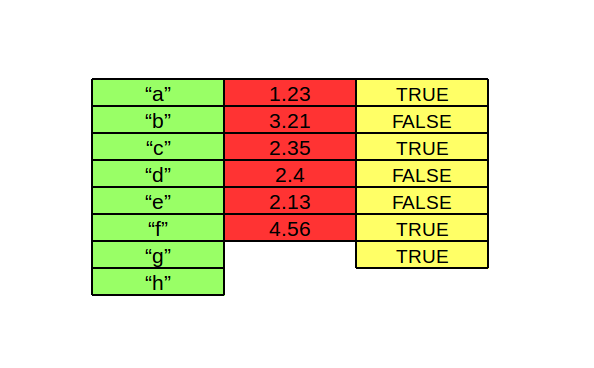]

---

# Properties

--

- .huge[List has the same properties as atomic vectors (`typeof()`, `length()`, `names()`)]

<br>

--

- .huge[New property: each element of a list can be of different types (even another list)]

---

# Creation: list()

```{r}
my_list <- list(c(1L, 2L, 3L), 
                text = c("a", "b"), 
                boolean = c(TRUE, FALSE, FALSE, TRUE))
str(my_list)
names(my_list)
```

---

# Combination: c()

```{r}
your_list <- list(num = c(12.34, 34.45, 45.56))
new_list <- c(my_list, your_list)
str(new_list)
```

---

# Conversion & checking:


```{r}
strings <- c("a", "b", "c", "e")
{{strings_list <- as.list(strings)}}
strings_list
```

---

# Conversion & checking:

```{r}
strings <- c("a", "b", "c", "e")
strings_list <- as.list(strings)
{{is.list(strings_list)}}
{{unlist(strings_list)}}
```


---

# Subsetting lists


```{r}
a <- list(a = 1:3, b = "a string", c = pi, d = list(-1, -5))
```


--

```{r}
#  `[` extracts a sub-list. The result will always be a list.
str(a[1:2])
```

---

# Subsetting lists


```{r}
a <- list(a = 1:3, b = "a string", c = pi, d = list(-1, -5))
```


--

```{r}
#  `[[` extracts a single component from a list.
str(a[[1]])
```


---

# Subsetting lists


```{r}
a <- list(a = 1:3, b = "a string", c = pi, d = list(-1, -5))
```

--

```{r}
# `$` is a shorthand for extracting named elements of a list
a$a
a[["a"]]
```


---


---
class: middle, center
exclude: true

.pull-left[
.giant[x]
]

.pull-right[

]


---
class: middle, center
exclude: true

.pull-left[
.giant[x[1]]
]

.pull-right[

]


---
class: middle, center
exclude: true

.pull-left[
.giant[x[[1]]]
]

.pull-right[

]

---
class: middle, center
exclude: true

.pull-left[
.giant[x[[1]][[1]]]
]

.pull-right[

]

---

# Why lists

.huge[Lists are used to build up many of the more complicated data structures 
in R (e.g. linear models)]

```{r}
reg_lm <- lm(dist ~ speed, data = cars)
is.list(reg_lm)
```


---

```{r}
summary(reg_lm)
```

---

# Why lists

```{r}
str(reg_lm)
```


---

# Your turn

.huge[Extracting `coefficients`, `residuals` and `fitted.values` from the 
following regression model]

```{r, eval=FALSE}
lm_regs <- lm(dist ~ speed, data = cars)
lm_regs
```


---

# Wrap-up

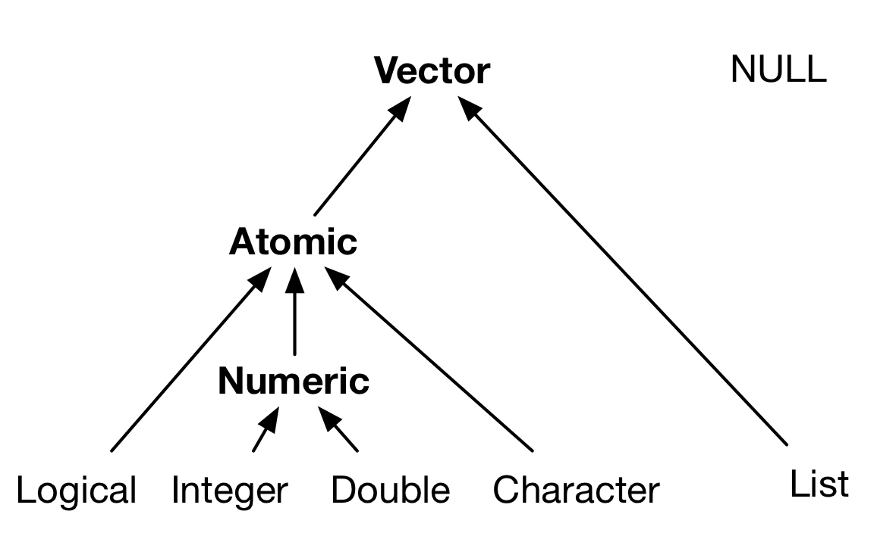

---
class: inverse, middle, center

.giant[.greenfont[Be the boss of your factors]]

---

# What is factor?

--

- .huge[Factors are used to store categorical data in R]

```{r}
{{sex <- factor(c("male", "female", "female", "male"))}}
sex
```

--

.pull-left[
```{r}
{{levels(sex)}}
```
]

.pull-right[
```{r}
{{nlevels(sex)}}
```
]

--

<br>

- .huge[Factors are the data type that R's users love to hate]

---

# The Janus-like nature of factors

--

.pull-left[

]

--

.pull-right[
```{r}
# look like strings
x <- factor(
  c("a", "b", 
    "b", "a")
  )
```


```{r}
class(x)
# but are integer underhood
typeof(x)
```
]

---

# The Janus-like nature of factors

.pull-left[
```{r}
unclass(x)
```

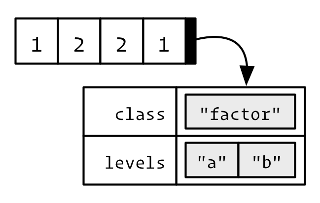
]

.pull-right[
```{r}
# look like strings
x <- factor(
  c("a", "b", 
    "b", "a")
  )
```


```{r}
class(x)
# but are integer underhood
typeof(x)
```
]


---

# How it can be useful? Counting

--

```{r}
month_chr <- c("Jan", "Dec", "Apr", "Nov", "May", "Apr")
table(month_chr)
```

--

```{r}
{{month_fac <- factor(month_chr, levels = month.abb)}}
# even groups that have no observations are counted
table(month_fac) 
```


---

# How it can be useful? Sorting


```{r}
month_chr <- c("Jan", "Dec", "Apr", "Nov", "May", "Apr")
sort(month_chr)
```

--

```{r}
{{month_fac <- factor(month_chr, levels = month.abb)}}
sort(month_fac) 
```

---

# How it can be useful? Reodering thoes bars

```{r, echo=FALSE}
dtf <- data.frame(Skill = c("Beginner", "Adv Beginner", "Intermediate", "Expert"),
                  Num = c(75, 60, 15, 25),
                  stringsAsFactors = FALSE)
```

.left-code[
```{r}
dtf
```

```{r reorder-bars1, eval=FALSE}
ggplot(
  dtf, aes(Skill, Num)
  ) + geom_col()
```
]

.right-plot[
```{r, ref.label="reorder-bars1", echo=FALSE, out.width="100%", fig.align='right', }
```
]

---

# How it can be useful? Reodering thoes bars

.left-code[
```{r}
dtf$Skill <- factor(
  dtf$Skill,
  levels = 
    c("Beginner", 
      "Adv Beginner", 
      "Intermediate", 
      "Expert")
  )
```

```{r reorder-bars2, eval=FALSE}
ggplot(
  dtf, aes(Skill, Num)
  ) + geom_col()
```
]

.right-plot[
```{r, ref.label="reorder-bars2", echo=FALSE, out.width="100%", fig.align='right', }
```
]

---

# How it might be evil? 

--

.huge[When you treat them like strings]


```{r}
month_fac <- factor(c("Jan", "Dec", "Apr", "Nov", "Apr"), 
                    levels = month.abb)
month_fac <- c(month_fac, "Oct")
month_fac
```

---

# How it might be evil?

.huge[When you try to get numeric vectors from factors]

--

.pull-left[
```{r}
y <- factor(c(101:103))
y
# bad
as.numeric(y)
```
]

--

.pull-right[
```{r}
# good
as.numeric(as.character(y))
```
]

---

# How it might be evil?

.huge[Do not subscript with factors]

```{r}
w <- c(a=4, b=44, c=444)
w[c("a", "c")]
w[factor(c("a", "c"))]
```

---

# Manipulating factors

.pull-left[
```{r, eval=FALSE}
# install.packages("forcats")
library(forcats)
```
]

.pull-right[
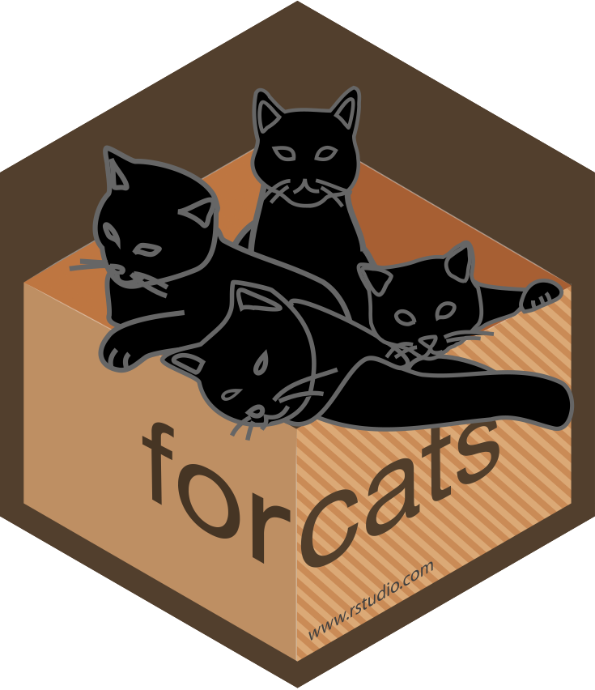
]

---

# Manipulating factors

- .huge[Modifying factor order]

<br>

- .huge[.grayfont[Modifying factor levels]]


---

# Change level order: fct_relevel()

```{r}
f <- factor(c("a", "b", "c", "d"))
f
```

.pull-left[
```{r}
{{fct_relevel(f, "c")}}
```
]

.pull-right[
```{r}
{{fct_relevel(f, "b", "d")}}
```
]


---

# Change level order: fct_inorder()

```{r}
f <- factor(c("b", "b", "a", "c", "c", "c"))
f
# orders according to the first appearance of each level
{{fct_inorder(f)}} 
```

---

# Change level order: fct_infreq()

```{r}
f <- factor(c("b", "b", "a", "c", "c", "c"))
f
# orders according to the frequency
{{fct_infreq(f)}}
```


---

# Change level order: fct_rev()

```{r}
f <- factor(c("b", "b", "a", "c", "c", "c"))
f
# reverse order of factor levels
{{fct_rev(f)}}
```


---

# Your turn

```{r}
air_quality <- read.csv("air-quality.csv")
by_categ <-  filter(air_quality, !is.na(aqi_categ))
str(by_categ$aqi_categ)
levels(by_categ$aqi_categ)
```

---

# Your turn

.left-code[
```{r plot0, eval=FALSE}
ggplot(
  by_categ, 
  aes(aqi_categ)
  ) +
  geom_bar()
```

.huge[Reoder the bars by levels of increasing frequency]

]

.right-plot[
```{r plot0-out, echo=FALSE, ref.label="plot0", out.width="100%", fig.align="right"}
```
]

---

# Solution


```{r, eval=FALSE}
by_categ <- mutate(by_categ, 
                   aqi_categ = fct_rev(fct_infreq(aqi_categ)))

ggplot(by_categ, aes(aqi_categ)) +
    geom_bar()
```


---

# Manipulating factors

- .huge[.grayfont[Modifying factor order]]

<br>

- .huge[Modifying factor levels]


---

# Change factor levels: fct_recode()


```{r}
x <- factor(c("apple", "bear", "banana", "dear"))
x
{{fct_recode(x, fruit = "apple", fruit = "banana")}}
```


---

# Change factor levels: fct_expand()


```{r}
f <- factor(c("b", "b", "a", "c", "c", "c"))
f
# add additional levels to a factor
{{fct_expand(f, "d", "e")}}
```

---

# Change factor levels: fct_collapse()

```{r}
f <- factor(c("b", "b", "a", "c", "c", "c"))
f
# collapse factor levels into manually defined groups
{{fct_collapse(f, G1 = c("a", "b"), G2 = "c")}}
```

---

# Your turn

.left-code[
```{r plot1, eval=FALSE, echo=FALSE}
by_categ <-  filter(air_quality, !is.na(aqi_categ))

by_categ <- mutate(by_categ,
                   aqi_categ = fct_collapse(aqi_categ,
                        Acceptalbe = c("Good", "Moderate"),
                        Dangerous = c("Unhealthy", "Unhealthy for Sensitive Groups"),
                        Deadly = c("Very Unhealthy", "Hazardous")
                   ))

by_categ$aqi_categ <- fct_relevel(by_categ$aqi_categ, "Acceptalbe", "Dangerous")

ggplot(by_categ, aes(aqi_categ)) +
    geom_bar()
```

.huge[Re-create AQI categories as follows:]

- .huge[Acceptalbe ~ Good, Moderate]
- .huge[Dangerous ~ Unhealthy, Unhealthy for Sensitive Groups]
- .huge[Deadly ~ Very Unhealthy, Hazardous]

.huge[And draw the plot on the right]

]

.right-plot[
```{r plot1-out, echo=FALSE, ref.label="plot1", out.width="100%", fig.align="right"}
```
]

---

# Solution

```{r, eval=FALSE}
by_categ <-  filter(air_quality, !is.na(aqi_categ))

by_categ <- mutate(
  by_categ,
  aqi_categ = fct_collapse(
    aqi_categ,
    Acceptalbe = c("Good", "Moderate"),
    Dangerous = c("Unhealthy", "Unhealthy for Sensitive Groups"),
    Deadly = c("Very Unhealthy", "Hazardous")
    )
  )

by_categ$aqi_categ <- fct_relevel(by_categ$aqi_categ, 
                                  "Acceptalbe", "Dangerous")
```


---
class: inverse, middle, center

.giant[.greenfont[Handle dates & times like a boss]]

---
class: center, middle

.giant[What is time?]

---
class: center, middle

.giant[What is time?]
<br>
.grayfont[.large[Hint: this is not a philosophical question]]

---

- .huge[Time is a measurement system]

<br>

- .huge[Time can be arranged on a time line]

.center[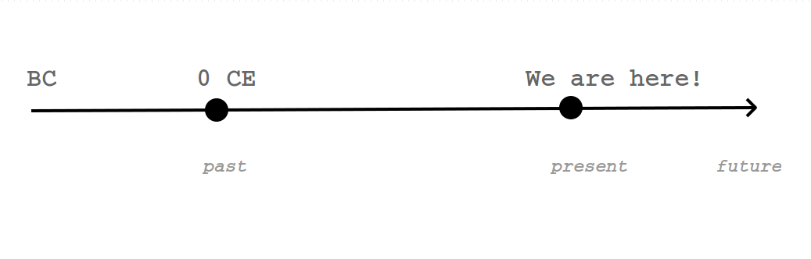]

---

- .huge[A date-time is a specific instant of time, a point in time line]

<br>

- .huge[For example: 27/12/2017 21:32:00]

.center[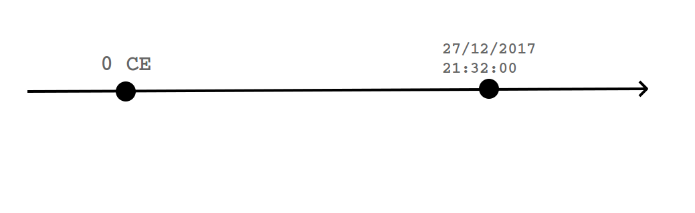]


---

# Identifying instants


.huge[1 - By reference: as the number of seconds since a reference time]

<br>

.huge[2 - By description: a unique combination of year, month, day, hour, minute, second, and time zones]


.center[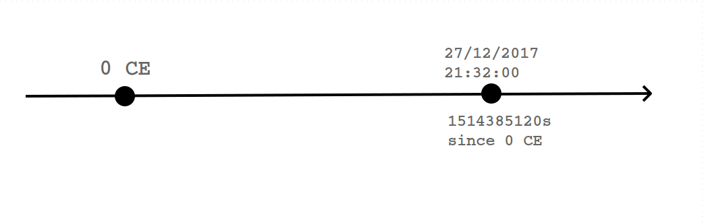]

---

# 'Date-time' objects


.huge[`datetimes` are stored as either `POSIXct` or `POSIXlt` objects]

--

<br>

- .huge[POSIXct objects are stored as the number of seconds since a reference 
time (default: `1970-01-01 00:00:00`)]

--

<br>

- .huge[POSIXct objects are stored as a unique combination of year, month, day, 
hour, minute, second, and time zone values]


---

```{r}
now <- Sys.time()
now
class(now)
typeof(now)
unclass(now)
```

---

.pull-left[
```{r}
now_lt <- as.POSIXlt(now)
typeof(now_lt)
```
]

.pull-right[
```{r}
unclass(now_lt)
```
]

---

# 'Date' objects

.huge[R uses 'Date' object to store instants that have only dates, but no times]

.huge[Dates are stored internally as the number of days from a reference date
(default: 1970-01-01)]

.pull-left[
```{r}
today <- Sys.Date()
class(today)
```
]

.pull-right[
```{r}
typeof(today)
unclass(today)
```
]

---

# Parsing dates

- .large[standard format: yyyy-mm-dd]

```{r}

dt1 <- as.Date("2012-07-22")
dt1
```

- .large[non-standard format]

```{r}

dt2 <- as.Date("03/20/2012", format = "%m/%d/%Y")
dt2

dt3 <- as.Date("November 6, 2011", format = "%B %d, %Y")
dt3
```


???

Sources:

http://www.thertrader.com/2014/04/18/date-formating-in-r/
http://www.noamross.net/blog/2014/2/10/using-times-and-dates-in-r---presentation-code.html


---

# Your turn

```
| Code 	| Value                             	|
|------	|-----------------------------------	|
| %d   	| Day of the month (decimal number) 	|
| %m   	| Month (decimal number)            	|
| %b   	| Month (abbreviated)               	|
| %B   	| Month (full name)                 	|
| %y   	| Year (2 digit)                    	|
| %Y   	| Year (4 digit)                    	|
```

---

.huge[Consult the previous table or `?strptime` and parse the following vectors
to 'Date' objects]

```{r}
date1 <- "6aug2005"

date2 <- "aug061999"

date3 <- "12-05-2001"

date4 <- "May 27 1984"

date5 <- "1998-22-07"

date6 <- "20041024"

date7 <- "22.10.2004"
```


---

# Wrap-up

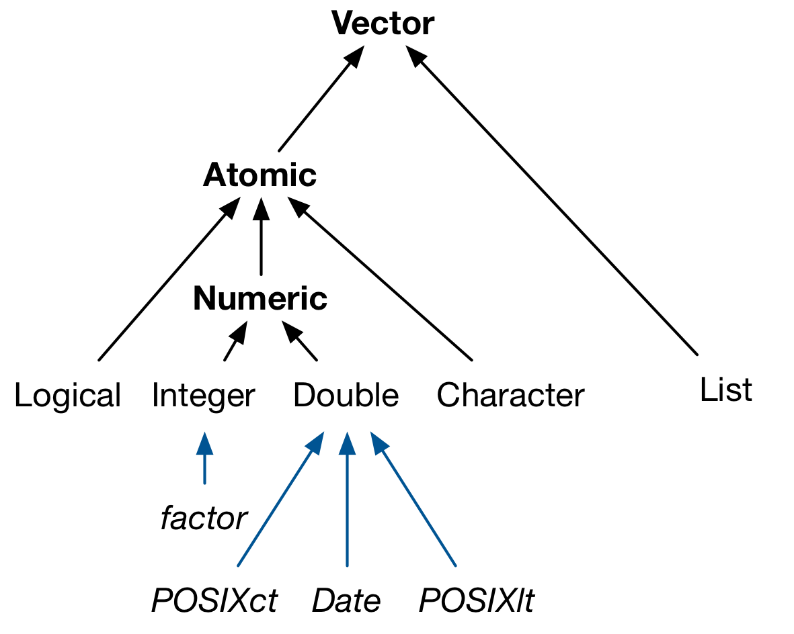

---
class: inverse, middle, center

.giant[.greenfont[Matrices & Arrays]]

---

# Matrix

```{r, eval=FALSE}
mat <- cbind(c(1L, 2L, 3L, 4L, 5L),
             c(6L, 7L, 8L, 9L, 10L),
             c(11L, 12L, 13L, 14L, 15L))
```

.center[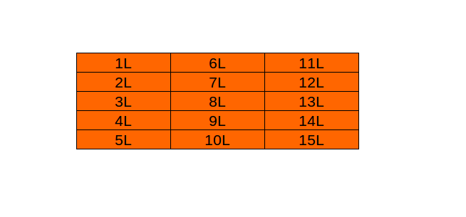]

---

# Matrix

```{r, eval=FALSE}
mat <- rbind(c(1L, 6L, 11L),
             c(2L, 7L, 12L),
             c(3L, 8L, 13L),
             c(4L, 9L, 14L),
             c(5L, 10L, 15L))
```

.center[]

---

# Matrix

```{r, eval=FALSE}
mat <- matrix(1L:15L, ncol = 3)
```

.center[]

---

# Properties

- .huge[typeof(), class()]

<br>

- .huge[colnames(), rownames()]

<br>

- .huge[nrow(), ncol()]

---


```{r}
mat <- matrix(1L:15L, ncol = 3, 
              dimnames = list(c("R1", "R2", "R3", "R4", "R5"),
                              c("A", "B", "C")))
```

.pull-left[
```{r}
class(mat)
mat
```
]

.pull-right[
```{r}
{{nrow(mat)}}

{{ncol(mat)}}

{{colnames(mat)}}

{{rownames(mat)}}
```
]

---

# Array

```{r, eval=FALSE}
arr <- array(1L:45L, dim = c(5, 3, 3))
```

.center[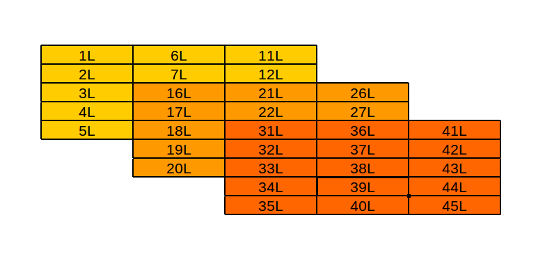]


---
class: inverse, middle, center

.giant[.greenfont[Data frames - the R's famed tabular d/s]]


---

```{r, eval=FALSE}
data.frame(x = c("a", "b", "c", "d", "e", "f", "g", "h"),
           z = c(1.23, 3.21, 2.35, 2.4, 2.13, 4.56, 2.13, 4.56),
           w = c(TRUE, FALSE, TRUE, FALSE, FALSE, TRUE, TRUE, TRUE),
           y = c(1L, 2L, 5L, 4L, 3L, 4L, 3L, 4L),
           stringsAsFactors = FALSE)
```

.center[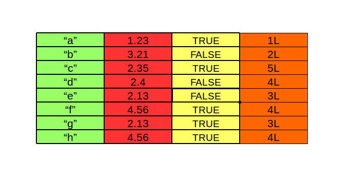]


---

# Properties

--

- .huge[A cross between matrix and list: 2-dimensional structure & 
Each column can have a different type]

--

- .huge[typeof(), class()]

--

- .huge[names() ~ colnames(), and rownames()]

--

- .huge[length() ~ ncol(), nrow()]


---

# Subsetting data frames

```{r}
data("mtcars")
head(mtcars)
```


---

# Your turn

.huge[Try to write the following codes in `dplyr` verbs]

---

```{r}
# everything 
mtcars[, ]
```

---

```{r}
# positive integer in either row or column
mtcars[1:4, ]
mtcars[, 1:4]
```

---

```{r}
# positive integer in both row & column
mtcars[1:4, 1:4]
```

---

```{r}
# negative integer subsetting
mtcars[-c(1:4), -c(1:4)]
```

---

```{r}
# column names selection
mtcars[, c("mpg", "hp", "vs", "am")]
```

---

```{r}
# logical subsetting
mtcars[mtcars$cyl %in% c(6, 8), ]
```

---

# Solution

```{r, eval=FALSE}
# mtcars[, ]
select(mtcars, everything())
# mtcars[1:4, ]
slice(mtcars, 1:4)
# mtcars[, 1:4]
# mtcars[1:4, 1:4]
# mtcars[-c(1:4), -c(1:4)]
# ==> no equivalent in dplyr
# mtcars[, c("mpg", "hp", "vs", "am")]
select(mtcars, mpg, hp, vs, am)
# mtcars[mtcars$cyl %in% c(6, 8), ]
filter(mtcars, cyl %in% c(6, 8))
```


---

# Your turn

.huge[Fix each of the following common data frame subsetting errors:]

```{r, eval=FALSE}
mtcars[mtcars$cyl = 4, ]

mtcars[-1:4, ]

mtcars[mtcars$cyl <= 5]

mtcars[mtcars$cyl == 4 | 6, ]
```

---

# Solution

```{r, eval=FALSE}
mtcars[mtcars$cyl == 4, ]

mtcars[-c(1:4), ]

mtcars[mtcars$cyl <= 5, ]

mtcars[mtcars$cyl == 4 | mtcars$cyl == 6, ]
```

---

# Wrap-up

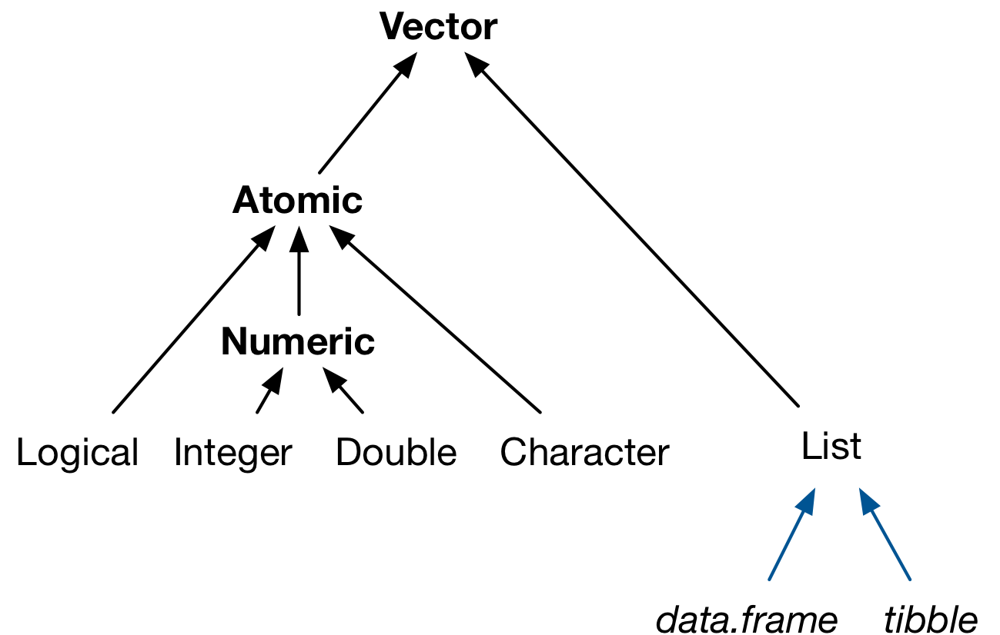

---
background-image: url(learning_not_failing.gif)
background-size: contain

---
class: inverse, middle, center

.giant[.greenfont[Moral of the story]]


---
background-image: url(https://media.giphy.com/media/h4Z6RfuQycdiM/giphy.gif)
background-size: cover
class: inverse, middle, center

# How are these things useful?

---

# Recall statistical data types

--

- .huge[Binary (yes/no)]

--

<br>

- .huge[Categorical (blood types: A, B, O, AB)]

--

<br>

- .huge[Ordinal (Likert scale: Like - Somewhat Like - Neutral - Somewhat Dislike - Dislike)]

--

<br>

- .huge[Count (housing census, number of click, views, likes)]

--

<br>

- .huge[Real-valued (temperature, height)]


---

# Represented in R

--

- .huge[Binary (yes/no)] .huge[.greenfont[.bold[==> logical]]]

--

<br>

- .huge[Categorical (blood types: A, B, O, AB)] .huge[.greenfont[.bold[==> factors]]]

--

<br>

- .huge[Ordinal (Likert scale: Like - Somewhat Like - Neutral - Somewhat Dislike - Dislike)] .huge[.greenfont[.bold[==> ordered factors]]]

--

<br>

- .huge[Count (housing census, number of click, views, likes)] .huge[.greenfont[.bold[==> integer]]]

--

<br>

- .huge[Real-valued (temperature, height)] .huge[.greenfont[.bold[==> double]]]


---

# Caveat

--

.huge[Functions behave differently depending on the input]

--

```{r}
num_vect <- c(1, 2, 3, 4, 5)
lgl_vect <- c(TRUE, FALSE, TRUE, FALSE)
chr_vect <- c("a", "b", "c", "d", "e")
dat_vect <- as.Date(c("2017-12-02", "2017-12-16", "2017-12-28"))
```

.pull-left[
```{r}
mean(num_vect)
mean(lgl_vect)
```
]

.pull-right[
```{r}
mean(chr_vect)
mean(dat_vect)
```
]


---
class: inverse, middle, center

.giant[.greenfont[Q&A]]
