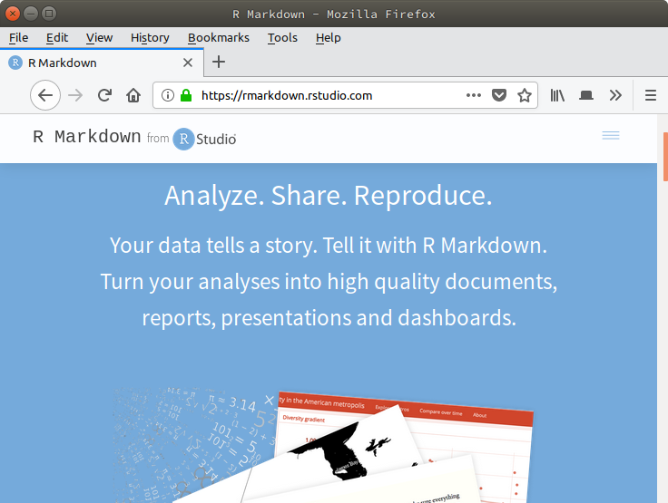

# Reproducible research and R authoring with markdown and knitr

***

## 1.  Introduction

This session introduces tools to author documents that include dynamically
generated analysis results (tables, figures, ...) produced with R. Bringing
data, results and their interpretation together in a single, coherent document
is invaluable to keep track of long and complex analyses, assure reproducibility
of the pipeline and the final report (any updates at the data or analysis level
are propagated at the report level) and to comprehensively communicate these
results to collaborators. A popular solution for this is **literate
programming**, a technique and set of tools that permit to

1. Write text and code within a single document. Here we will use the simple
  markdown syntax and include R code chunks; such documents are denoted R
  Markdown documents and have the Rmd extension. More on this in the next
  section.

2. Extract and execute the code: this is called *tangling*.

3. Replace the code chunks with their output into the original document: this is
  called *weaving*.

4. Render the document into a final, easily read format such as pdf or html.

Steps 2 to 4 are can be executed individually or automated into a single command
such as `knitr::knit2html` (i.e. function knit2html from the package knitr) or
`rmarkdown::render`, or using the RStudio editor.

Other types of document and frameworks that combine a programming and authoring
languages are Sweave files (with Rnw extension, that combine LaTeX and R**,
Jupyter/IPython for python, R and other languages, orgmode

***

## 2. R Markdown

R Markdown is an authoring format that enables easy creation of dynamic
documents, presentations, and reports from R. It combines the core syntax of
markdown (an easy-to-write plain text format) with embedded R code chunks. R
Markdown documents are fully reproducible (they can be automatically regenerated
whenever underlying R code or data changes).

This document describes R Markdown v2 based on
[knitr](https://yihui.name/knitr/) and [pandoc](http://pandoc.org/), the
workhorse that converts markdown to html and many other formats. We will focus
the generation of reports such this document in html and pdf, although other
formats and type of documents are available.

Note that PDF output requires a full installation of TeX and that pandoc is a
third party application that needs to be installed outside of R unless you use
RStudio, which bundles all necessary R packages and pandoc.

> We would also like to warn against using MS Word as output document, as this
> breaks the support for reproducibility. The final, compiled document should be
> used for rendering only (which is implicit for html of pdf files**; editing
> should be performed on the original documents, i.e the Rmd file.

***

## 3. References

- Bioconductor's [Rmarkdown tutorial](https://www.bioconductor.org/help/course-materials/2015/CSAMA2015/lab/rr-authoring.html)
- https://yihui.name/knitr/
- http://pandoc.org/
