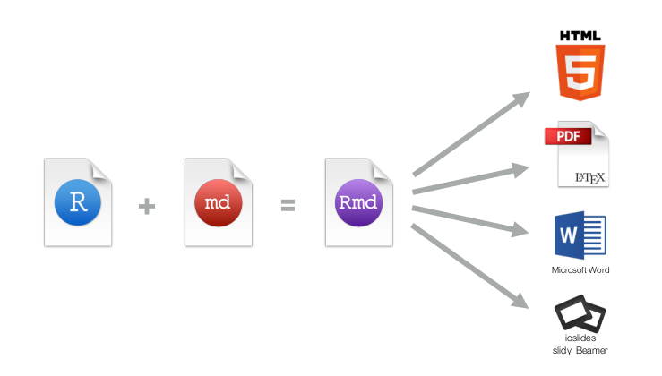
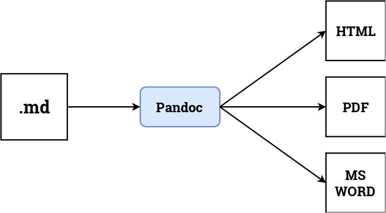
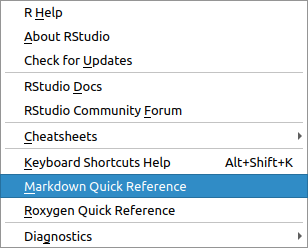
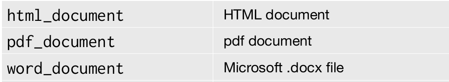
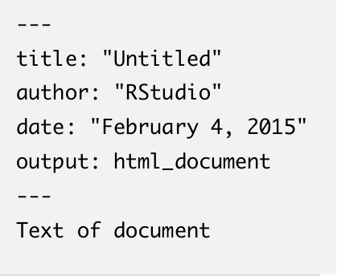
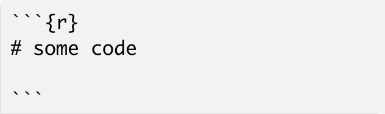
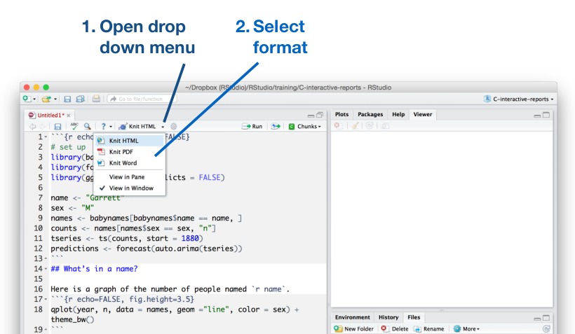
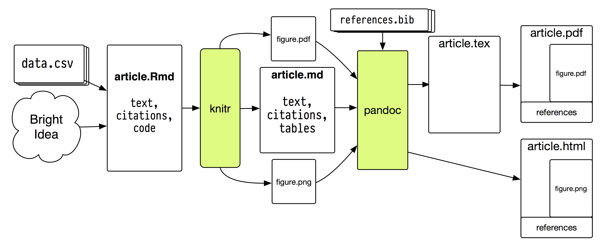

```{r setup, include=FALSE}
options(htmltools.dir.version = FALSE)
knitr::opts_chunk$set(comment = "R>", message = FALSE, warning = FALSE)
```

background-image: url(future-notebook.png)
background-size: contain

---
background-image: url(reproducible-research.jpg)
background-size: contain

---
background-image: url(rmd-enterprise.png)
background-size: contain

---

# The problems

- .large[Excel for data entry]

<br>

- .large[SPSS/Stata/Excel for data analysis, visualization]

<br>

- .large[Word/Latex for publication]

---

# One format to rule them all

- .large[A single document containing analysis, code, and results]



---
class: inverse, middle, center


.h0[Markdown]

---

# What is Markdown?

--

- .large[A plain text formatting syntax]

<br>

--

- .large[Render to complex formats: HTML, PDF, ...]


---

# Pandoc - Universal document converter



---

# What does it look like?

.pull-left[

<br>

`# Header 1`

<br>

`## Header 2`

`Normal paragraph looks like this.`

`**Bold text**`

`*Italic text*`

`* Unordered list`

`1. Ordered list`

]

.pull-right[

# Header 1

## Header 2

Normal paragraph looks like this.

**Bold text**

*Italic text*

* Unordered list

1. Ordered list

]

---
class: center

# RStudio Help > Markdown References




---
class: middle, center

.h0[Demo 1]

---
class: inverse, middle, center

.h0[R Mardown]

---

# What is R Markdown?


- .large[Embed R code in a Markdown document]

<br>

- .large[Render textual output along with codes/graphics]

<br>

- .large[File extensions: `.Rmd`, `.rmd`]

---

# Output Formats



---

# YAML

- .large[Document metadata: title, author, etc.]

- .large[A section of key:value pairs separated by dashed lines `———`]



---

# Embed code

.large[Insert a chunk of R code with:]



---

# Complie documents



---
class: middle, center

.h0[Demo 2]

---
background-image: url(rmd-cheatsheet.png)
background-size: contain
class: center, middle

---

# Workflow



.footnote[
[The Plain Person’s Guide to Plain Text Social Science](http://plain-text.co/index.html#introduction)
]

---

# Wrap-up

- .large[Automatically regenerate documents when code, data, or assumptions
  change]

- .large[Eliminate transposition errors that occur when copying results into
  documents]

- .large[Documentation for the analytic and computational processes from which
  conclusions are drawn]

---
class: inverse, middle,center

.h0[Questions]


???

* https://vickysteeves.gitlab.io/repro-papers/r-markdown-in-reproducible-research.html
* https://rpubs.com/marschmi/105639
* http://labrtorian.com/2018/02/05/reproducible-research-write-your-clinical-chemistry-paper-using-r/
* https://www.bioconductor.org/help/course-materials/2015/CSAMA2015/lab/rr-authoring.html
* http://www.helsinki.fi/varieng/series/volumes/19/flanagan/
* https://warwick.ac.uk/fac/sci/wdsi/events/vacationschool2016/for-participants/materials/knitr.pdf
* https://www.britishecologicalsociety.org/wp-content/uploads/2017/12/guide-to-reproducible-code.pdf
* https://paulromer.net/jupyter-mathematica-and-the-future-of-the-research-paper/
* https://slides.yihui.name/2012-knitr-RStudio.html#3.2
* http://plain-text.co/pull-it-together.html
* https://www.ssc.wisc.edu/sscc/pubs/RFR/RFR_RMarkdown.html
