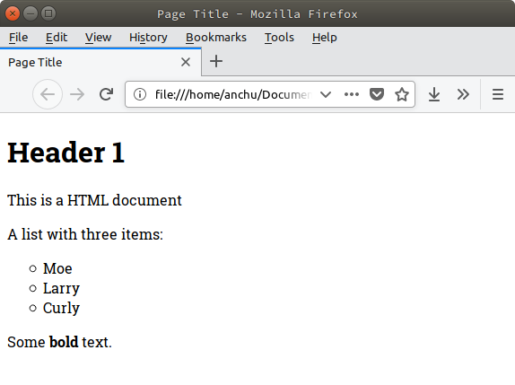
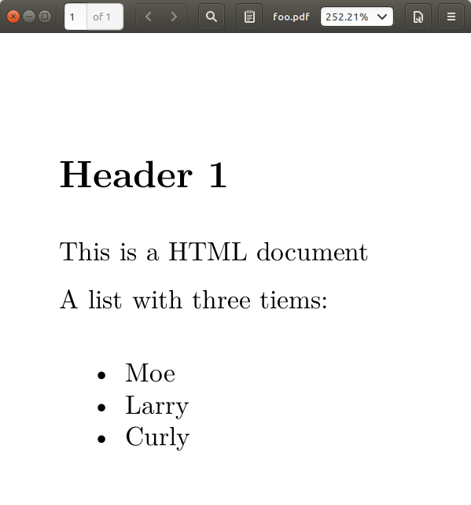
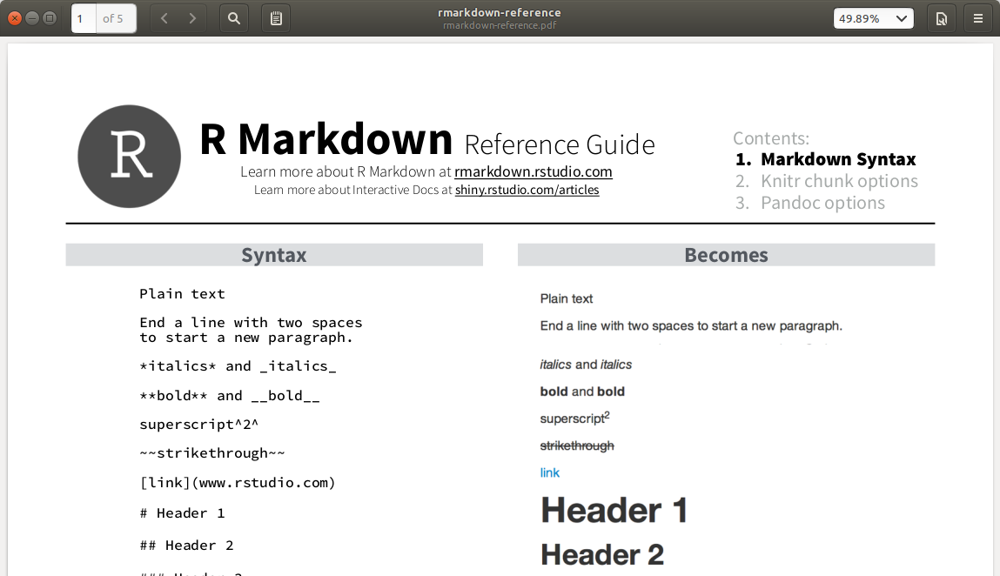
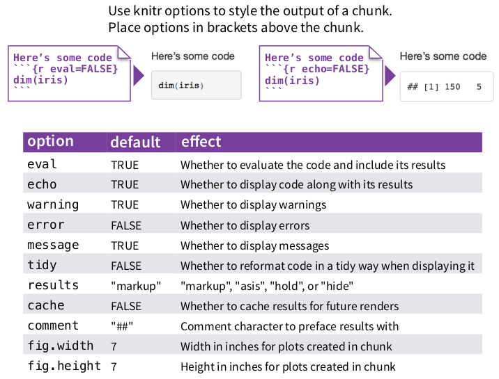

```{r setup, include=FALSE}
options(htmltools.dir.version = FALSE)
knitr::opts_chunk$set(comment = "R>", message = FALSE, warning = FALSE)
chunk <- "```"
inline <- function(x = "") paste0("`` `r ", x, "` ``")
```

background-image: url(irreproducible-research.png)
background-size: contain

???

- Reproducible research is hard
- Many factors attribute to replication of a research
- One of the form of PR is verify analysis & results

---
background-image: url(reproducible-research.jpg)
background-size: contain

---

# The problem

- .large[Excel for data entry]

<br>

- .large[SPSS/Stata/Excel for data analysis, visualization]

<br>

- .large[Word/Latex for publication]

---

# One format to rule them all

- .large[A single document containing analysis, code, and results]


---
class: inverse, middle, center

.h0[Markdown]

---
class: middle, center

.center[]
.center[.large[foo.html]]

---
class: middle

```html
<!DOCTYPE html>
<html>
  <head>
    <title>Page Title</title>
  </head>
  <body>
    <h1>Header 1</h1>
    <p>This is a HTML document</p>
    <p>A list with three items:</p>
    <ul style="list-style-type:circle">
      <li>Moe</li>
      <li>Larry</li>
      <li>Curly</li>
    </ul>
    <p>Some <strong>bold</strong> text.</p>
  </body>
</html>
```
.center[.large[foo.html]]

---
background-image: url(https://media.giphy.com/media/EsmlrgWNx5v0Y/giphy.gif)
background-size: contain

---
class: middle

```html
<!DOCTYPE html>
<html>
  <head>
*    <title>Page Title</title>
  </head>
  <body>
    <h1>Header 1</h1>
    <p>This is a HTML document</p>
    <p>A list with three items:</p>
    <ul style="list-style-type:circle">
      <li>Moe</li>
      <li>Larry</li>
      <li>Curly</li>
    </ul>
    <p>Some <strong>bold</strong> text.</p>
  </body>
</html>
```
.center[.large[foo.html]]

---
class: middle

```html
<!DOCTYPE html>
<html>
  <head>
    <title>Page Title</title>
  </head>
  <body>
*    <h1>Header 1</h1>
*    <p>This is a HTML document</p>
*    <p>A list with three items:</p>
    <ul style="list-style-type:circle">
      <li>Moe</li>
      <li>Larry</li>
      <li>Curly</li>
    </ul>
    <p>Some <strong>bold</strong> text.</p>
  </body>
</html>
```
.center[.large[foo.html]]

---
class: middle

```html
<!DOCTYPE html>
<html>
  <head>
    <title>Page Title</title>
  </head>
  <body>
    <h1>Header 1</h1>
    <p>This is a HTML document</p>
    <p>A list with three items:</p>
    <ul style="list-style-type:circle">
*      <li>Moe</li>
*      <li>Larry</li>
*      <li>Curly</li>
    </ul>
    <p>Some <strong>bold</strong> text.</p>
  </body>
</html>
```
.center[.large[foo.html]]

---
class: middle

```html
<!DOCTYPE html>
<html>
  <head>
    <title>Page Title</title>
  </head>
  <body>
    <h1>Header 1</h1>
    <p>This is a HTML document</p>
    <p>A list with three items:</p>
    <ul style="list-style-type:circle">
      <li>Moe</li>
      <li>Larry</li>
      <li>Curly</li>
    </ul>
*    <p>Some <strong>bold</strong> text.</p>
  </body>
</html>
```
.center[.large[foo.html]]

---
class: middle

```markdown
# Header 1

This is a HTML document

A list with three tiems:

- Moe
- Larry
- Curly
```
.center[.large[foo.md]]

---
background-image: url(https://media.giphy.com/media/7zDgTR3KbytSSGOuvo/giphy.gif)
background-size: contain

---
class: middle

.large[`"The idea is that a Markdown-formatted document should be publishable
as-is, as plain text, without looking like it’s been marked up with tags or
formatting instructions"`]

.right[.large[John Gruber, creator of Markdown]]


---
class: middle

.pull-left[
```markdown
# Header 1

This is a HTML document

A list with three tiems:

- Moe
- Larry
- Curly
```
.center[.large[foo.md]]
]

.pull-right[

.center[.large[foo.pdf]]
]

---
class: middle

.pull-left[
```markdown
# Header 1

This is a HTML document

NA list with three tiems:

- Moe
- Larry
- Curly
```
.center[.large[foo.md]]
]

.pull-right[

.center[.large[foo.docx]]
]


---

# Pandoc - Universal document converter

.center[]

---

# Caveats

--

- .large[Markdown is a plain text formatting syntax]

<br>

--

- .large[Why Markdown? It's easy, fast, portable, flexible]

<br>

--

- .large[Pandoc helps to convert Markdown to complex format: html, pdf, etc.]

---

# RStudio Help > Markdown References



---
class: middle, center

.h0[Demo 1]

.enormous[Reproduce file:

`demo-markdown.html`]

---


- .large[[X] Headers]

- .large[[X] Emphasis (italic, bold)]

- .large[[X] Lists (numbered, bullet)]

- .large[[X] Links]

- .large[[X] Images]

- .large[[X] Blockquotes]

- .large[[X] Horizontal rule]

- .large[[X] Line breaks]

- .large[[X] Inline code]

- .large[[...] Tables]


---
class: inverse, middle, center

.h0[R Mardown]

---

# What is R Markdown?

- .large[Embed R code in a Markdown document]

- .large[Render textual output along with codes/graphics]

- .large[File extensions: `.Rmd`, `.rmd`]

```r
install.packages('knitr')
```
.center[]


---

```{r plain-text, echo = FALSE, comment = ""}
cat(htmltools::includeText("untitled.Rmd"))
```

---
background-image: url(untitled.png)
background-size: contain


---

# YAML header

- .large[Document metadata: title, author, date, output, etc.]

- .large[A section of key:value pairs separated by dashed lines]

```yaml
---
title: "A simple R Markdown document"
author: "An Chu"
date: "July 01, 2018"
output: html_document
---
```

---

# Output formats

```yaml
*output: html_notebook
*output: html_document
*output: pdf_document
*output: word_document
output: md_document
output: rtf_document
output: ioslides_presentation
output: slidy_presentation
output: beamer_presentation
output: powerpoint_presentation
...
```

.large[[Ref: R Markdown formats](https://rmarkdown.rstudio.com/formats.html)]

---

# Embed code

.large[Insert a chunk of R code with:]

.center[]


---

# Chunk options

.center[]

---

# Complie documents


---
class: middle, center

.h0[Demo 2]

.enormous[Reproduce file:

`demo-rmarkdown.html`]

---

# Wrap-up

.large[The R Markdown's approach to author reporting:]

- .large[Facilitate regenerating documents when code, data, or assumptions
  change]

- .large[Eliminate transposition errors that occur when copying results into
  documents]

- .large[Document the analytic and computational processes from which
  conclusions are drawn]

---

# Further reading

.large[
- [Writing Academic Papers with Rmarkdown](https://daijiang.name/en/2017/04/05/writing-academic-papers-with-rmarkdown/)
- [Reproducible research: Strategies, tools, and workflows](http://www.helsinki.fi/varieng/series/volumes/19/flanagan/)
- [A Guide to Reproducible Code in Ecology and Evolution (pdf)](https://www.britishecologicalsociety.org/wp-content/uploads/2017/12/guide-to-reproducible-code.pdf)
- [The Plain Person’s Guide to Plain Text Social Science](http://plain-text.co/pull-it-together.html)
- [R for Researchers: R Markdown](https://www.ssc.wisc.edu/sscc/pubs/RFR/RFR_RMarkdown.html)
]

---
class: inverse, middle,center

.h0[Q&A]


???

* https://vickysteeves.gitlab.io/repro-papers/r-markdown-in-reproducible-research.html
* https://rpubs.com/marschmi/105639
* http://labrtorian.com/2018/02/05/reproducible-research-write-your-clinical-chemistry-paper-using-r/
* https://www.bioconductor.org/help/course-materials/2015/CSAMA2015/lab/rr-authoring.html
* http://www.helsinki.fi/varieng/series/volumes/19/flanagan/
* https://warwick.ac.uk/fac/sci/wdsi/events/vacationschool2016/for-participants/materials/knitr.pdf
* https://www.britishecologicalsociety.org/wp-content/uploads/2017/12/guide-to-reproducible-code.pdf
* https://paulromer.net/jupyter-mathematica-and-the-future-of-the-research-paper/
* https://slides.yihui.name/2012-knitr-RStudio.html#3.2
* http://plain-text.co/pull-it-together.html
* https://www.ssc.wisc.edu/sscc/pubs/RFR/RFR_RMarkdown.html
