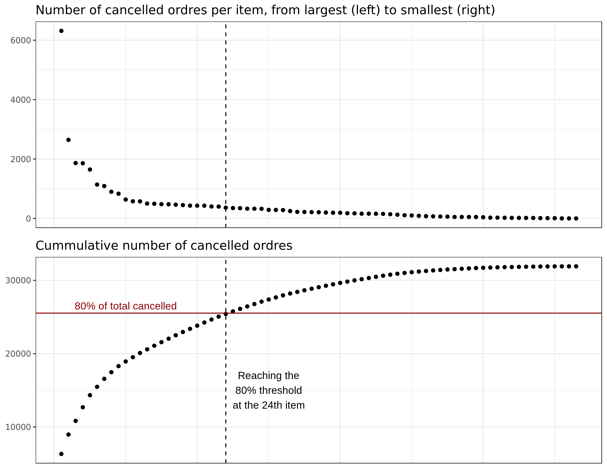
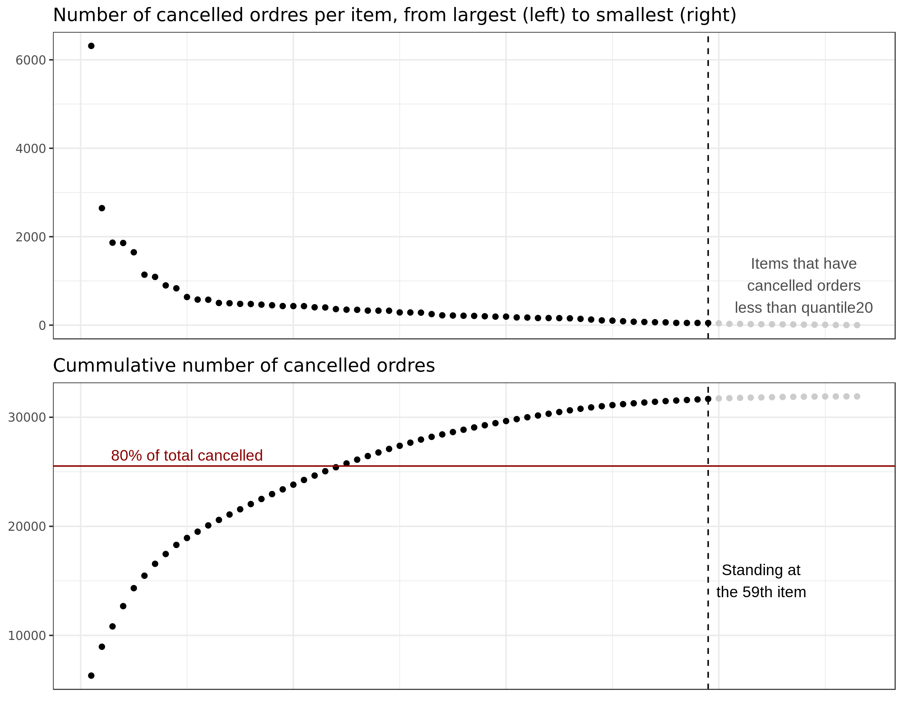

## To quantile or not to quantile
Ref: http://rpubs.com/minhthu/404294


```r
library(readr)
library(dplyr)
library(ggplot2)
library(patchwork)
```

```r
sales <- read_csv("sales_canceled.csv")
```

### Count the number of cancellation per item


```r
cancelled <- sales %>%
    filter(Status == "Canceled") %>%
    group_by(Item.Code) %>%
    summarise(n_cancelled = sum(Quantity)) %>%
    arrange(desc(n_cancelled))
```


```
## # A tibble: 73 x 3
##    Item.Code n_cancelled    id
##        <int>       <int> <int>
##  1    111931        6315     1
##  2  10135358        2646     2
##  3   1040765        1865     3
##  4  10098739        1858     4
##  5  10135771        1648     5
##  6  10133703        1141     6
##  7   1041106        1091     7
##  8   1040774         899     8
##  9   1041105         833     9
## 10  10106230         636    10
## # ... with 63 more rows
```

Calculate 80% of the cancelled


```r
threshold <- round(sum(cancelled$n_cancelled) * 0.8, 0)
```

```
## [1] 25530
```

Calculate the 20% quantile of the cancelled


```r
quantile20 <- round(quantile(cancelled2$n_cancelled, 0.2), 0)
```

```
## 20% 
##  49
```

### Solution 1
**Idea: Keep items that account for 80% of all cancelled orders**



### Solution 2
**Idea: keep items that have number of cancelled orders greater than the 20%
quantile of all cancelled orders.**



