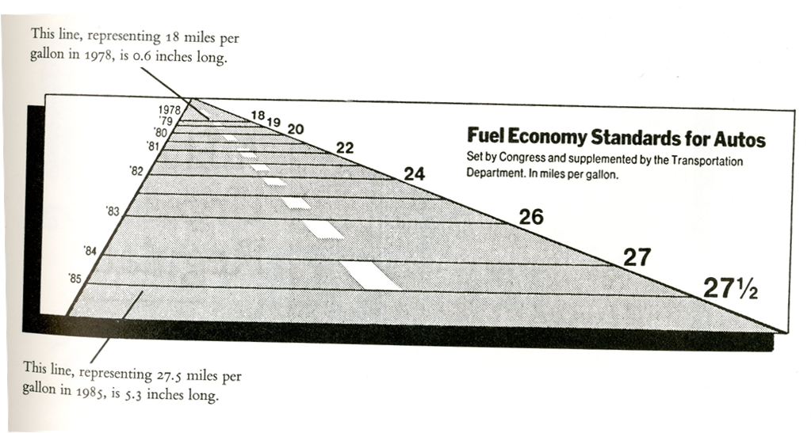

```{r setup, include=FALSE}
options(htmltools.dir.version = FALSE, width = 90)
knitr::opts_chunk$set(fig.width=4.25, fig.height=3.5, fig.retina=3, fig.align = "center",
                      message=FALSE, warning=FALSE, cache = TRUE,
                      autodep = TRUE, hiline=TRUE, dev = "svg")
library(readr)
library(tidyr)
library(dplyr)
library(ggplot2)
library(patchwork)
library(gridExtra)
```

background-image: url(hex-ggplot2.png)
background-size: contain

---
class: middle, center

.superenormous[https://tinyurl.com/data-vis-class]

---
class: inverse, center, middle

.h0[Axis Scales & Transformations]


---
class: middle

.giant[.greenfont[Scales] control the mapping from .greenfont[data] to
.greenfont[aesthetics]]

---
class: middle

.giant[You can generate many plots .greenfont[without knowing how scales work]]

---

.left-code[
```{r plot1, eval=FALSE}
## position mapping
ggplot(mpg,
    aes(displ, hwy)
) + geom_point()
```

```r
x ==> disp
y ==> hwy
```
]

.right-plot[
```{r plot1-out, ref.label="plot1", echo=FALSE, out.width="100%", fig.align='right'}
```
]


---

# What actually happens:

```r
ggplot(mpg, aes(displ, hwy)) +
    geom_point() +
    scale_x_continuous() +
    scale_y_continuous()

## the mappings now are obivious:

disp ==> scale_x_continuous()
hwy ==> scale_y_continuous()

```

???

The use of + to “add” scales to a plot is a little misleading. When you + a
scale, you’re not actually adding it to the plot, but overriding the existing
scale.

---

# Axis scales <= types of data

```r
## for continuous data
scale_x/y_continuous()

## for discrete data
scale_x/y_discrete()

## for date/datetime/time data
scale_x/y_date()
scale_x/y_datetime()
scale_x/y_time()
```


---

# Common options


```yaml
name   : name of scale

breaks : control the breaks in the axis

labels : labels of axis tick marks

limits : control x or y axis limits

trans  : axis transformations ('log2', 'log10', ...)
```

---

.left-code[

# Naming axis

```{r plot2, eval=FALSE}
ggplot(mpg,
    aes(displ, hwy)
) + geom_point() +
  scale_x_continuous(
    name = "Engine displacement (L)"
  ) + 
  scale_y_continuous(
    name = "Highway MPG"
  )
```
]

.right-plot[
```{r plot2-out, ref.label="plot2", echo=FALSE, out.width="100%", fig.align='right'}
```
]

---

.left-code[

# Naming axis

```{r plot3, eval=FALSE}
ggplot(mpg,
    aes(displ, hwy)
) + 
geom_point() +
labs(
x = "Engine displacement (L)",
y = "Highway MPG"
)
```
]

.right-plot[
```{r plot3-out, ref.label="plot3", echo=FALSE, out.width="100%", fig.align='right'}
```
]


---

.left-code[

# Setting axis breaks

```{r plot4, eval=FALSE}
ggplot(mpg,
    aes(displ, hwy)
) + 
geom_point() +
scale_x_continuous(
breaks = seq(2, 7, 0.5)
)
```
]

.right-plot[
```{r plot4-out, ref.label="plot4", echo=FALSE, out.width="100%", fig.align='right'}
```
]

---

.left-code[

# Setting axis labels

```{r plot5, eval=FALSE}
ggplot(mpg,
    aes(displ, hwy)
) + 
geom_point() +
scale_x_continuous(
breaks = seq(2, 7, 2),
labels = c("two", "four", "six")
)
```
]

.right-plot[
```{r plot5-out, ref.label="plot5", echo=FALSE, out.width="100%", fig.align='right'}
```
]

---

.left-code[

# Setting axis limits

```{r plot6, eval=FALSE}
ggplot(mpg,
    aes(displ, hwy)
) + 
geom_point() +
scale_y_continuous(
limits = c(10, 40)
)
```
]

.right-plot[
```{r plot6-out, ref.label="plot6", echo=FALSE, out.width="100%", fig.align='right'}
```
]


---

.left-code[

# Setting axis limits

```{r plot7, eval=FALSE}
ggplot(mpg,
    aes(displ, hwy)
) + 
geom_point() +
ylim(10, 40)
```

```r
# xlim()
```

]

.right-plot[
```{r plot7-out, ref.label="plot7", echo=FALSE, out.width="100%", fig.align='right'}
```
]

---

.left-code[

# Transformations

```{r plot8, eval=FALSE}
ggplot(mpg,
    aes(displ, hwy)
) + 
geom_point() +
scale_y_continuous(
trans = "reverse"
)
```

```r
# Others:
# trans = "log10"
# trans = "log2"
# trans = "sqrt"
```

]

.right-plot[
```{r plot8-out, ref.label="plot8", echo=FALSE, out.width="100%", fig.align='right'}
```
]

---

.left-code[

# Transformations

```{r plot9, eval=FALSE}
ggplot(mpg,
    aes(displ, hwy)
) + 
geom_point() +
scale_y_reverse()

```

```r
# Others:
# scale_y_log10()
# scale_y_log2()
# scale_y_sqrt()
```
]

.right-plot[
```{r plot9-out, ref.label="plot9", echo=FALSE, out.width="100%", fig.align='right'}
```
]


---
class: middle, center


.h0[Critique by redesign]

---
background-image: url(cpi.png)
background-size: contain


---

```{r plot10, echo=FALSE, out.width="65%", fig.align='center'}
cpi <- data.frame(
    year = 2010:2017,
    cpi = c(8.25, 12.79, 15.95, 6.91, 4.83, 0.74, 1.25, 4.96)
)

plot_a1 <- ggplot(cpi, aes(year, cpi)) +
    geom_line(size = 1, color = "#40655e") +
    geom_point(size = 2, color = "#40655e") +
    labs(title = "CPI quý I/2017 tăng cao nhất trong 3 năm") +
    scale_x_continuous(name = NULL,
                       breaks = 2010:2017,
                       labels = c("Q1/2010", paste0("'", 11:17))) +
    scale_y_continuous(name = NULL,
                       breaks = cpi$cpi,
                       labels = paste0(cpi$cpi, "%")) +
    theme(panel.grid.minor.y = element_blank(),
          panel.grid.minor.x = element_blank())
plot_a1
```

---

# Solution

```{r, eval=FALSE}
ggplot(cpi, aes(year, cpi)) +
    geom_line(size = 1, color = "#40655e") +
    geom_point(size = 2, color = "#40655e") +
    labs(title = "CPI quý I/2017 tăng cao nhất trong 3 năm qua") +
    scale_x_continuous(name = NULL,
                       breaks = 2010:2017,
                       labels = c("Q1/2010", 
                                  paste0("'", 11:17))) +
    scale_y_continuous(name = NULL,
                       breaks = cpi$cpi,
                       labels = paste0(cpi$cpi, "%"))
```

---
background-image: url(health-bar-chart.png)
background-size: contain

---

```{r plot11, echo=FALSE, out.width="100%", fig.align='center', fig.asp=9/17}
health_index <- data.frame(
    country = c("Italy", "Iceland", "Thụy Sĩ", "Singapore", "Australia",
                "Tây Ban Nha", "Nhật Bản", "Thụy Điển", "Isarel", "Luxembourg"),
    score = c(93.11, 91.21, 90.75, 90.23, 89.24, 89.19, 89.15, 88.92, 88.14, 87.87),
    stringsAsFactors = FALSE
)

health_index <- health_index %>%
    mutate(country = forcats::fct_reorder(country, score))

ggplot(health_index,
       aes(country, score)) +
    geom_col() +
    labs(x = NULL, y = NULL,
         title = "Truncated axis") +
    theme_gray(base_size = 7) +
    coord_flip(ylim = c(87, 94)) -> none_zero_baseline

ggplot(health_index,
       aes(country, score)) +
    geom_col() +
    labs(x = NULL, y = NULL,
         title = "Full-scale axis") +
    scale_y_continuous(expand = c(0, 0), limits = c(0, 100)) +
    theme_gray(base_size = 7) +
    coord_flip() -> zero_baseline

none_zero_baseline + zero_baseline
```


---

# Solution

```{r, eval=FALSE}
ggplot(health_index, aes(country, score)) +
    geom_col() +
    labs(x = NULL, y = NULL, title = "Truncated axis") +
    coord_flip(ylim = c(87, 94)) -> none_zero_baseline

ggplot(health_index,
       aes(country, score)) +
    geom_col() +
    labs(x = NULL, y = NULL, title = "Full-scale axis") +
    coord_flip() -> zero_baseline
```


---

# Zooming the plot

<br>

.enormous[with scales]

<br>

.enormous[with coordinate systems]


---

.left-code[

```{r plot9a, eval=FALSE}
p <- ggplot(
  mtcars, 
  aes(disp, wt)) +
  geom_point() +
  geom_smooth()
p
```
]

.right-plot[
```{r plot9a-out, ref.label="plot9a", echo=FALSE, out.width="100%", fig.align='right'}
```
]


---

.left-code[

# With scales

```{r plot9b, eval=FALSE}
p + scale_x_continuous(
  limits = c(325, 500)
  )
```
]

.right-plot[
```{r plot9b-out, ref.label="plot9b", echo=FALSE, out.width="100%", fig.align='right'}
```
]

---

.left-code[

# With coordinates

```{r plot9c, eval=FALSE}
p + coord_cartesian(
  xlim = c(325, 500)
  )
```
]

.right-plot[
```{r plot9c-out, ref.label="plot9c", echo=FALSE, out.width="100%", fig.align='right'}
```
]


---
class: middle

.center[]

---

```{r plot12, echo=FALSE, out.width="95%", fig.align='center', fig.asp=9/17}
gasoline_price <- data.frame(
    date = c("2016-09-20", "2016-10-05", "2016-10-20", "2016-11-04", "2016-11-19",
             "2016-12-20", "2017-02-18", "2017-03-06", "2017-03-21", "2017-04-05"),
    price = c(16232, 16404, 16845, 16892, 16374, 17594, 18098, 18018, 17314, 17234),
    stringsAsFactors = FALSE
)

gasoline_price$date <- as.Date(gasoline_price$date)

plot_a2 <- ggplot(gasoline_price, aes(date, price)) +
    geom_point() +
    geom_step() +
    labs(title = "Biểu đồ giá xăng") +
    scale_x_date(name = NULL,
                 breaks = gasoline_price$date) +
    scale_y_continuous(name = NULL,
                       breaks = seq(16500, 18000, 500),
                       labels = c("16,500", "17,000", "17,500", "(VND)\n18,000")) +
    theme_gray(base_size = 6) +
    theme(axis.text.x = element_text(angle = 45, vjust = 0.5),
          panel.grid.minor = element_blank())
plot_a2
```


---

# Solution

```{r, eval=FALSE}
ggplot(gasoline_price, aes(date, price)) +
    geom_point() +
    geom_step() +
    labs(title = "Biểu đồ giá xăng") +
    scale_x_date(name = NULL,
                 breaks = gasoline_price$date) +
    scale_y_continuous(name = NULL,
                       breaks = seq(16500, 18000, 500),
                       labels = c("16,500", "17,000", 
                                  "17,500", "(VND)\n18,000"))
```


---
background-image: url(thue-moi-truong.jpg)
background-size: contain

---

.huge[Lie factor = Size-of-effect-shown-in-graphic / Size-of-effect-in-data]



---
class: middle, center

.enormous[Size of effect in graphic = (5.3 - 0.6) / 0.6 = 7.83]

.enormous[Size of effect in data = (27.5 - 18) / 18 = 0.52]

.enormous[Lie factor = 7.83 / 0.52 = 15]


---

```{r plot13, echo=FALSE, out.width="95%", fig.align='center', fig.asp=9/16}
env_tax <- data.frame(
    year = 2012:2016,
    revenue = c(11.2, 11.5, 11.9, 27, 41.9),
    spending = c(9, 9.7, 9.9, 11.4, 12.3)
)

env_tax <- env_tax %>%
    gather(type, amount, -year) %>%
    mutate(type = case_when(
        type == "revenue" ~ "Thu",
        type == "spending" ~ "Chi",
    ))

plot_a3 <- ggplot(env_tax, aes(year, amount, color = type)) +
    geom_line() +
    geom_point(size = rel(1.1)) +
    labs(x = NULL, y = NULL,
         title = "Thu và Chi Thuế Bảo Vệ Môi Trường",
         subtitle = "Đơn vị: nghìn tỷ đồng",
         caption = "Nguồn dữ liệu: Vnexpress/Infographics") +
    scale_color_manual(name = NULL, values = c("#9c954d", "#b067a3")) +
    theme_gray(base_size = 6)
```


---
class: middle, center

.enormous[Size of effect in graphic = (10 - 4) / 4 = 1.5]

.enormous[Size of effect in data = (41.9 - 12.3) / 12.3 = 2.4]

.enormous[Lie factor = 1.5 / 2.4 = 0.6]


---

# Solution

```{r, eval=FALSE}
env_tax <- env_tax %>%
    gather(type, amount, -year) %>% 
    mutate(type = case_when(
          type == "revenue" ~ "Thu",
          type == "spending" ~ "Chi",
    ))

ggplot(env_tax, aes(year, amount, color = type)) +
    geom_line() +
    geom_point() +
    labs(x = NULL, y = NULL,
         title = "Thu và Chi Thuế Bảo Vệ Môi Trường",
         subtitle = "Đơn vị: nghìn tỷ đồng",
         caption = "Nguồn dữ liệu: Vnexpress/Infographics")
```


---
class: inverse, center, middle


.h0[Color Scales]


---

# Choosing color is hard

--

.huge[R has:]

--

- .huge[657 named colors (run: `colors()`)]

--

- .huge[7 default color sets (`rainbow()`, `heat.colors()`, `terrain.colors()`,
`topo.colors()`, `cm.colors()`, `gray.colors()`)]

--

- .huge[and a bunch of color packages (`viridis`, `RColorBrewer`,
`colorspace`, ...)]


---

# When choosing color:

<br>

<br>

<br>

> .center[.h9[Above all, do no harm.]]

> .right[.huge[Edward R. Tufte]]


---

# Think carefully what you are using color for


.huge[Fundamental use of color in visualization:]

- .huge[to label (color as noun)]

- .huge[to measure (color as quantity)]

- .huge[to represent and imitate reality (color as representation)]

- .huge[to decorate (color as beauty)]


---
background-image: url(rainfall.png)
background-size: contain


---
background-image: url(rta.png)
background-size: 60%


---

.left-code[
```{r plot200a, eval=FALSE}
## color mapping
ggplot(mpg,
    aes(displ, hwy,
  color = factor(cyl))
) + geom_point()
```

```r
x ==> disp
y ==> hwy
color ==> cyl
```
]

.right-plot[
```{r plot200a-out, ref.label="plot200a", echo=FALSE, out.width="100%", fig.align='right'}
```
]


---

# Color scales

```r
## continuous colour scales
scale_color/fill_continuous()

## evenly spaced colours for discrete data
scale_color/fill_hue()

## gradient colour scales
scale_color/fill_gradient()
scale_color/fill_gradient2()
scale_color/fill_gradientn()

## sequential grey colour scales
scale_color/fill_grey()
```

---

# Color scales

```r
## color for map from colorbrewer.org
scale_color/fill_brewer()
scale_color/fill_distiller()

## viridis colour scales from viridisLite
scale_color/fill_viridis_d()
scale_color/fill_viridis_c()

## pick your own colors
scale_color/fill_manual()
```

---
background-image: url(iwanthue.png)
background-size: 70%


---

.left-code[
```{r plot201, eval=FALSE}
ggplot(iris,
  aes(Sepal.Length,
      Sepal.Width,
      color = Species)
) + geom_point()
```

]

.right-plot[
```{r plot201-out, ref.label="plot201", echo=FALSE, out.width="100%", fig.align='right'}
```
]

---

.left-code[
```{r plot202, eval=FALSE}
ggplot(iris,
  aes(Sepal.Length,
      Sepal.Width,
      color = Species)
) + geom_point() +
  scale_color_manual(
  values = c("#ffb921",
             "#4e5ae1",
             "#00b67e")
  )
```
]

.right-plot[
```{r plot202-out, ref.label="plot202", echo=FALSE, out.width="100%", fig.align='right'}
```
]

---

.left-code[
```{r plot203, eval=FALSE}
ggplot(iris,
  aes(Sepal.Length,
      Sepal.Width,
      color = Species)
) + geom_point() +
  scale_color_manual(
  values = c("#82aeff",
             "#86bb06",
             "#b10024")
  )
```
]

.right-plot[
```{r plot203-out, ref.label="plot203", echo=FALSE, out.width="100%", fig.align='right'}
```
]


---
background-image: url(color-brewer.png)
background-size: 70%

---

.left-code[
```{r plot204, eval=FALSE}
ggplot(iris,
  aes(Sepal.Length,
      Sepal.Width,
      color = Species)
) + geom_point() +
  scale_color_manual(
  values = c("#1b9e77",
             "#d95f02",
             "#7570b3")
  )
```
]

.right-plot[
```{r plot204-out, ref.label="plot204", echo=FALSE, out.width="100%", fig.align='right'}
```
]

---

.left-code[
```{r plot205, eval=FALSE}
ggplot(iris,
  aes(Sepal.Length,
      Sepal.Width,
      color = Species)
) + geom_point() +
  scale_color_manual(
  values = c("#e41a1c",
             "#377eb8",
             "#4daf4a")
  )
```
]

.right-plot[
```{r plot205-out, ref.label="plot205", echo=FALSE, out.width="100%", fig.align='right'}
```
]

---
class: middle, center


.h0[Critique by redesign]


---
background-image: url(gii-color.png)
background-size: contain

???

https://infographics.vn/chi-so-doi-moi-sang-tao-cua-viet-nam-tiep-tuc-tang/10590.vna


---

```{r plot207, echo=FALSE, out.width="95%", fig.align='center', fig.asp=9/16}
gii_index <- readr::read_csv("gii-index.csv")

gii_index <- gii_index %>%
    mutate(criteria = forcats::fct_reorder(criteria, score))

plot_a4 <- ggplot(gii_index, aes(factor(criteria), score,
                      color = factor(year))) +
    geom_point(size = rel(1.1)) +
    labs(x = NULL, y =NULL,
         title = "Chỉ số đổi mới sáng tạo toàn cầu",
         subtitle = "Kết quả 2018 và mục tiêu 2020") +
    scale_color_manual(name = NULL,
                       values = c("#b067a3",
                                 "#9c954d")) +
    coord_flip() +
    theme_gray(base_size = 6)
plot_a4
```


---

# Solution

```{r, eval=FALSE}
gii_index <- readr::read_csv("gii-index.csv")
gii_index <- gii_index %>%
    mutate(criteria = forcats::fct_reorder(criteria, score))

ggplot(gii_index, aes(criteria, score,
                      color = factor(year))) +
    geom_point(size = 2) +
    labs(x = NULL, y =NULL,
         title = "Chỉ số đổi mới sáng tạo toàn cầu",
         subtitle = "Kết quả 2018 và mục tiêu 2020") +
    scale_color_manual(name = NULL,
                       values = c("#b067a3",
                                 "#9c954d")) +
    coord_flip()
```


---
background-image: url(pci.png)
background-size: contain


---

```{r plot208, echo=FALSE, out.width="95%", fig.align='center', fig.asp=9/16}
pci <- data.frame(
    year = 2011:2015,
    hanoi = c(36, 51, 33, 26, 24),
    haiphong = c(45, 50, 15, 34, 28),
    danang = c(5, 12, 1, 1, 1),
    saigon = c(20, 13, 10, 4, 6),
    cantho = c(16, 14, 6, 15, 14)
)

pci <- pci %>%
    gather(city, rank, -year) %>%
    mutate(city = case_when(
        city == "cantho" ~ "Cần Thơ",
        city == "danang" ~ "Đà Nẵng",
        city == "haiphong" ~ "Hải Phòng",
        city == "hanoi" ~ "Hà Nội",
        city == "saigon" ~ "Sài Gòn",
    ))

plot_a5 <- ggplot(pci, aes(year, rank, color = city)) +
    geom_point(size = rel(0.8)) +
    geom_line() +
    labs(x = NULL, y = NULL,
         title = "Thứ hạng PCI của 5 thành phố trực thuộc TW",
         caption = "Nguồn: VCCI") +
    scale_y_reverse() +
    scale_color_viridis_d(name = NULL) +
    theme_gray(base_size = 6)
plot_a5
```

---

```{r, eval=FALSE}
pci <- gather(pci, city, rank, -year) %>%
    mutate(city = case_when(
        city == "cantho" ~ "Cần Thơ",
        city == "danang" ~ "Đà Nẵng",
        city == "haiphong" ~ "Hải Phòng",
        city == "hanoi" ~ "Hà Nội",
        city == "saigon" ~ "Sài Gòn",
    ))

ggplot(pci, aes(year, rank, color = city)) +
    geom_point() + geom_line() + 
    labs(x = NULL, y = NULL,
         title = "Thứ hạng PCI của 5 thành phố trực thuộc TW",
         caption = "Nguồn: VCCI") +
    scale_y_reverse() +
    scale_color_viridis_d(name = NULL)
```


---
background-image: url(bad_chart3.png)
background-size: 50%

???

https://news.zing.vn/gia-nha-chung-cu-ha-noi-giam-manh-25-chi-sau-5-nam-post721075.html


---

```{r plot209, echo=FALSE, out.width="95%", fig.align='center', fig.asp=9/16}
apart_price <- data.frame(
    district = c("Hà Đông", "Long Biên", "Ba Đình", "Cầu Giấy", "Đống Đa", "Tây Hồ", "Bắc TL",
             "Nam TL", "Hoàng Mai", "Thanh Xuân"),
    q012016 = c(78.94, 85.18, 84.45, 79.22, 79.23, 87.25, 73.69, 74.47, 75.27, 80.72),
    q042015 = c(78, 84, 86, 79, 80, 87, 73, 74, 74, 82),
    stringsAsFactors = FALSE
)

apart_price <- apart_price %>%
    mutate(q012016 = q012016 - 100,
           q042015 = q042015 - 100) %>%
    mutate(district = forcats::fct_reorder(district, q012016))

apart_price <- apart_price %>%
    gather(year, rate, -district) %>%
    mutate(year = case_when(
        year == "q012016" ~ "Q01/2016",
        year == "q042015" ~ "Q04/2015",
    ))

plot_a6 <- ggplot(apart_price, aes(district, rate)) +
    geom_point(aes(fill = year, alpha = year), shape = 21, size = rel(2.5), color = "white") +
    scale_fill_manual(name = NULL, values = c("red4", "gray80")) +
    scale_alpha_manual(values = c(1, 0.8), guide = FALSE) +
    scale_y_continuous(limits = c(-28, 0),
                       labels = scales::percent_format(scale = 1)) +
    labs(x = NULL, y = NULL,
         title = "Gía nhà chung cư Hà Nội giảm mạnh sau 5 năm",
         subtitle = "Thời điểm gốc: Quý 1/2011") +
    theme_minimal(base_size = 6) +
    theme(panel.grid.major.x = element_blank())
plot_a6
```

---

# Solution

```{r, eval=FALSE}
apart_price <- apart_price %>%
    mutate(q012016 = q012016 - 100,
           q042015 = q042015 - 100) %>%
    mutate(district = forcats::fct_reorder(district, q012016))

apart_price <- apart_price %>%
    gather(year, rate, -district) %>%
    mutate(year = case_when(
        year == "q012016" ~ "Q01/2016",
        year == "q042015" ~ "Q04/2015",
    ))
```

---

# Solution (cont.)

```{r, eval=FALSE}
ggplot(apart_price, aes(district, rate)) +
    geom_point(aes(fill = year, alpha = year), 
               shape = 21, size = 5, color = "white") +
    scale_fill_manual(name = NULL, 
                      values = c("red4", "gray80")) +
    scale_alpha_manual(values = c(1, 0.8), guide = FALSE) +
    scale_y_continuous(limits = c(-28, 0),
                       labels = scales::percent_format(scale = 1)) +
    labs(x = NULL, y = NULL,
         title = "Gía nhà chung cư Hà Nội giảm mạnh sau 5 năm",
         subtitle = "Thời điểm gốc: Quý 1/2011") +
    theme_minimal()
```


---
class: inverse, center, middle
exclude: true


.h0[4 - Legends]


---
exclude: true

# Your turn


---
exclude: true

# Solution


---
class: inverse, center, middle
exclude: true

.h0[5 - Themes]


---
class: middle, center
exclude: true

.giant[It's all about .greenfont[details]]

---
exclude: true

# Built-in themes

```r
theme_gray() # default
theme_bw()
theme_linedraw()
theme_light()
theme_dark()
theme_minimal()
theme_classic()
theme_void()
theme_test() 
```

---
exclude: true

.left-code[
```{r plot60, eval=FALSE}
p <- ggplot(
  mpg, aes(displ, hwy)
) + geom_point()

p + theme_gray()
```

]

.right-plot[
```{r plot60-out, ref.label="plot60", echo=FALSE, out.width="100%", fig.align='right'}
```
]

---
exclude: true

.left-code[
```{r plot61, eval=FALSE}
p <- ggplot(
  mpg, aes(displ, hwy)
) + geom_point()

p + theme_minimal()
```

]

.right-plot[
```{r plot61-out, ref.label="plot61", echo=FALSE, out.width="100%", fig.align='right'}
```
]

---
exclude: true

.left-code[
```{r plot62, eval=FALSE}
p <- ggplot(
  mpg, aes(displ, hwy)
) + geom_point()

p + theme_bw()
```

]

.right-plot[
```{r plot62-out, ref.label="plot62", echo=FALSE, out.width="100%", fig.align='right'}
```
]


---
exclude: true

.left-code[
```{r plot63, eval=FALSE}
p <- ggplot(
  mpg, aes(displ, hwy)
) + geom_point()

p + theme_classic()
```

]

.right-plot[
```{r plot63-out, ref.label="plot63", echo=FALSE, out.width="100%", fig.align='right'}
```
]

---
exclude: true

# Modify components of a theme

```{r, eval=FALSE}
theme() # there's a ton of components
```

```{r, eval=FALSE}
theme(line, rect, text, title, aspect.ratio, axis.title, axis.title.x,
  axis.title.x.top, axis.title.x.bottom, axis.title.y, axis.title.y.left,
  axis.title.y.right, axis.text, axis.text.x, axis.text.x.top,
  axis.text.x.bottom, axis.text.y, axis.text.y.left, axis.text.y.right,
  axis.ticks, axis.ticks.x, axis.ticks.x.top, axis.ticks.x.bottom, axis.ticks.y,
  axis.ticks.y.left, axis.ticks.y.right, axis.ticks.length, axis.line,
  axis.line.x, axis.line.x.top, axis.line.x.bottom, axis.line.y,
  axis.line.y.left, axis.line.y.right, legend.background, legend.margin,
  legend.spacing, legend.spacing.x, legend.spacing.y, legend.key,
  legend.key.size, legend.key.height, legend.key.width, legend.text,
  legend.text.align, legend.title, legend.title.align, legend.position,
  legend.direction, legend.justification, legend.box, legend.box.just,
  legend.box.margin, legend.box.background, legend.box.spacing,
  panel.background, panel.border, panel.spacing, panel.spacing.x,
  panel.spacing.y, panel.grid, panel.grid.major, panel.grid.minor,
  panel.grid.major.x, panel.grid.major.y, panel.grid.minor.x,
  panel.grid.minor.y, panel.ontop, plot.background, plot.title, plot.subtitle,
  plot.caption, plot.tag, plot.tag.position, plot.margin, strip.background,
  strip.background.x, strip.background.y, strip.placement, strip.text,
  strip.text.x, strip.text.y, strip.switch.pad.grid, strip.switch.pad.wrap, ...,
  complete = FALSE, validate = TRUE)
```

???

https://ggplot2.tidyverse.org/reference/theme.html

---
class: inverse, center, middle

.h0[Layout]


---


# Two approaches


.enormous[`gridExtra`: flexible]


```r
# install.packages("gridExtra")
```

.enormous[`patchwork`: simple]

```r
# install.packages("devtools")
# devtools::install_github("thomasp85/patchwork")
```

---
class: middle, center

.h0[patchwork]


---

```{r}
p1 <- ggplot(mtcars) + 
  geom_point(aes(mpg, disp))
p2 <- ggplot(mtcars) + 
  geom_boxplot(aes(gear, disp, group = gear))
p3 <- ggplot(mtcars) + geom_smooth(aes(disp, qsec))
p4 <- ggplot(mtcars) + geom_bar(aes(carb))
```

---
exclude: true

.left-code18[
```{r plot80, eval=FALSE, echo=FALSE}
p1 + p2 & theme_gray(base_size = 7)
```

```{r plot80t, eval=FALSE}
p1 + p2
```
]

.right-plot80[
```{r plot80-out, ref.label="plot80", echo=FALSE, out.width="100%", fig.align='right', fig.asp=8/13}
```
]

---
exclude: true

.left-code[
```{r plot81, eval=FALSE, echo=FALSE}
p1 + p2 + plot_layout(ncol = 1) & theme_gray(base_size = 7)
```

```{r plot81t, eval=FALSE}
p1 + p2 +
  plot_layout(
    ncol = 1
    )
```
]

.right-plot[
```{r plot81-out, ref.label="plot81", echo=FALSE, out.width="100%", fig.align='right'}
```
]

---
exclude: true

.left-code[
```{r plot82, eval=FALSE, echo=FALSE}
p1 + p2 - p3 + plot_layout(ncol = 1) & theme_gray(base_size = 7)
```

```{r plot82t, eval=FALSE}
p1 + p2 - p3 + 
  plot_layout(ncol = 1)
```
]

.right-plot[
```{r plot82-out, ref.label="plot82", echo=FALSE, out.width="100%", fig.align='right'}
```
]

---
exclude: true

.left-code[
```{r plot83, eval=FALSE, echo=FALSE}
p1 + p2 - p3 + plot_layout(ncol = 2) & theme_gray(base_size = 7)
```

```{r plot83t, eval=FALSE}
p1 + p2 + p3 + 
  plot_layout(ncol = 2)
```
]

.right-plot[
```{r plot83-out, ref.label="plot83", echo=FALSE, out.width="100%", fig.align='right'}
```
]

---
exclude: true

.left-code[
```{r plot84, eval=FALSE, echo=FALSE}
p1 | p2 / p3 & theme_gray(base_size = 7)
```

```{r plot84t, eval=FALSE}
p1 | p2 / p3
```
]

.right-plot[
```{r plot84-out, ref.label="plot84", echo=FALSE, out.width="100%", fig.align='right'}
```
]

---


.left-code[
```{r plot85, eval=FALSE, echo=FALSE}
(p1 | p2) & theme_gray(base_size = 7)
```

```{r plot85t, eval=FALSE}
p1 | p2
```
]

--

.right-plot[
```{r plot85-out, ref.label="plot85", echo=FALSE, out.width="100%", fig.align='right'}
```
]

---

.left-code[
```{r plot86, eval=FALSE, echo=FALSE}
(p1 / p2) & theme_gray(base_size = 7)
```

```{r plot86t, eval=FALSE}
p1 / p2
```
]

--

.right-plot[
```{r plot86-out, ref.label="plot86", echo=FALSE, out.width="100%", fig.align='right'}
```
]

---

.left-code[
```{r plot87, eval=FALSE, echo=FALSE}
((p1 | p2) / p3) & theme_gray(base_size = 7)
```

```{r plot87t, eval=FALSE}
(p1 | p2) / p3
```
]

.right-plot[
```{r plot87-out, ref.label="plot87", echo=FALSE, out.width="100%", fig.align='right'}
```
]

---

.left-code[
```{r plot88, eval=FALSE, echo=FALSE}
(p1 | (p2 / p3)) & theme_gray(base_size = 7)
```

```{r plot88t, eval=FALSE}
p1 | (p2 / p3)
```
]

.right-plot[
```{r plot88-out, ref.label="plot88", echo=FALSE, out.width="100%", fig.align='right'}
```
]

---

.left-code[
```{r plot89, eval=FALSE, echo=FALSE}
(p1 / (p2 | p3) / p4) & theme_gray(base_size = 7)
```

```{r plot89t, eval=FALSE}
p1 / (p2 | p3) / p4
```
]

.right-plot[
```{r plot89-out, ref.label="plot89", echo=FALSE, out.width="100%", fig.align='right'}
```
]

---

.left-code[
```{r plot90, eval=FALSE, echo=FALSE}
(p1 / (p2 | (p3 / p4))) & theme_gray(base_size = 7)
```

```{r plot90t, eval=FALSE}
p1 / (p2 | (p3 / p4))
```
]

.right-plot[
```{r plot90-out, ref.label="plot90", echo=FALSE, out.width="100%", fig.align='right'}
```
]


---
background-image: url(topxe.jpg)
background-size: contain

???

https://vnexpress.net/infographics/oto-xe-may/top-xe-ban-chay-nhat-thang-2-tai-viet-nam-toyota-chiem-lai-3-ngoi-dau-3552446.html

---

```{r, echo=FALSE, out.width="95%", fig.align='center', fig.asp=9/16}
car_sales <- readr::read_csv("top_sales.csv")

car_sales <- car_sales %>%
    group_by(auto) %>%
    mutate(total_sales = sum(sales)) %>%
    ungroup() %>%
    mutate(auto = forcats::fct_reorder(auto, total_sales))

pall <- ggplot(car_sales, aes(auto, sales, fill = region)) +
    geom_col(show.legend = FALSE) +
    labs(x = NULL, y = NULL,
         title = "10 ôtô bán chạy nhất Việt Nam 02/2017") +
    scale_fill_manual(values = c("#cb6751",
                                 "#7aa457",
                                 "#9e6ebd")) +
    coord_flip() +
    theme_minimal() +
    theme(panel.grid.major.y = element_blank())

south <- ggplot(filter(car_sales, region == "South")) +
    geom_col(aes(forcats::fct_reorder(auto, sales), sales),
             fill = "#9e6ebd") +
    labs(x = NULL, y = NULL, title = "Miền Nam") +
    coord_flip() +
    theme_minimal() +
    theme(panel.grid.major.y = element_blank())

central <- ggplot(filter(car_sales, region == "Central")) +
    geom_col(aes(forcats::fct_reorder(auto, sales), sales),
             fill = "#cb6751") +
    labs(x = NULL, y = NULL, title = "Miền Trung") +
    coord_flip() +
    theme_minimal() +
    theme(panel.grid.major.y = element_blank())

north <- ggplot(filter(car_sales, region == "North")) +
    geom_col(aes(forcats::fct_reorder(auto, sales), sales),
             fill = "#7aa457") +
    labs(x = NULL, y = NULL, title = "Miền Bắc") +
    coord_flip() +
    theme_minimal() +
    theme(panel.grid.major.y = element_blank())

(south | north | central) / pall & theme_minimal(base_size = 5)
```

---

# Solution

```{r, eval=FALSE}
car_sales <- readr::read_csv("top_sales.csv")

car_sales <- car_sales %>%
    group_by(auto) %>%
    mutate(total_sales = sum(sales)) %>%
    ungroup() %>%
    mutate(auto = forcats::fct_reorder(auto, total_sales))
```

---

# Solution (cont.)

```{r, eval=FALSE}
pall <- ggplot(car_sales, aes(auto, sales, fill = region)) +
    geom_col(show.legend = FALSE) +
    labs(x = NULL, y = NULL,
         title = "10 ôtô bán chạy nhất Việt Nam 02/2017") +
    scale_fill_manual(values = c("#cb6751",
                                 "#7aa457",
                                 "#9e6ebd")) +
    coord_flip() +
    theme_minimal() +
    theme(panel.grid.major.y = element_blank())
pall
```

---

# Solution (cont.)

```{r, eval=FALSE}
south <- ggplot(filter(car_sales, region == "South")) +
    geom_col(aes(forcats::fct_reorder(auto, sales), sales),
             fill = "#9e6ebd") +
    labs(x = NULL, y = NULL, title = "Miền Nam") +
    coord_flip() +
    theme_minimal() +
    theme(panel.grid.major.y = element_blank())
south

```

---

# Solution (cont.)

```{r, eval=FALSE}
central <- ggplot(filter(car_sales, region == "Central")) +
    geom_col(aes(forcats::fct_reorder(auto, sales), sales),
             fill = "#cb6751") +
    labs(x = NULL, y = NULL, title = "Miền Trung") +
    coord_flip() +
    theme_minimal() +
    theme(panel.grid.major.y = element_blank())
central
```

---

# Solution (cont.)

```{r, eval=FALSE}
north <- ggplot(filter(car_sales, region == "North")) +
    geom_col(aes(forcats::fct_reorder(auto, sales), sales),
             fill = "#7aa457") +
    labs(x = NULL, y = NULL, title = "Miền Bắc") +
    coord_flip() +
    theme_minimal() +
    theme(panel.grid.major.y = element_blank())
north

(south | north | central) / pall
```

