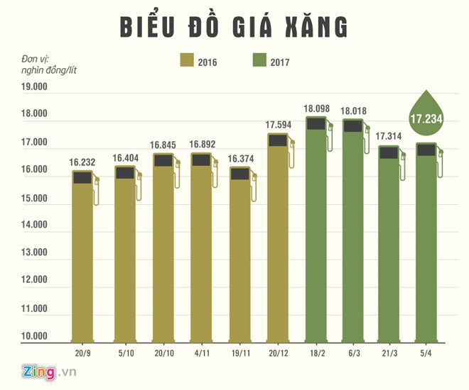

```{r setup, include=FALSE}
options(htmltools.dir.version = FALSE, width = 90)
knitr::opts_chunk$set(fig.width=4.25, fig.height=3.5, fig.retina=3, fig.align = "center",
                      message=FALSE, warning=FALSE, cache = TRUE,
                      autodep = TRUE, hiline=TRUE, dev = "svg")
library(readr)
library(dplyr)
library(ggplot2)
```

background-image: url(hex-ggplot2.png)
background-size: contain


---
class: inverse, center, middle

.h0[1 - Scales]


---
class: middle


.giant[Scales control the mapping from .greenfont[data] to
.greenfont[aesthetics]]


---
class: middle

.giant[You can generate many plots .greenfont[without knowing how scales work]]

---

.left-code[
```{r plot1, eval=FALSE}
## position mapping
ggplot(
    mpg,
    aes(displ, hwy)
)
```

```r
x ~ disp
y ~ hwy
```
]

.right-plot[
```{r plot1-out, ref.label="plot1", echo=FALSE, out.width="100%", fig.align='right'}
```
]

---

```{r, include=FALSE}
mpg$cyl <- factor(mpg$cyl)
```

.left-code[
```{r plot2, eval=FALSE}
## position mapping +
## color mapping
ggplot(
    mpg,
    aes(displ, hwy,
        color = cyl)
) + geom_point()
```

```r
x ~ disp
y ~ hwy
color ~ cyl
```

]

.right-plot[
```{r plot2-out, ref.label="plot2", echo=FALSE, out.width="100%", fig.align='right'}
```
]

---

# What actually happens:

```{r, eval=FALSE}

ggplot(mpg, aes(displ, hwy, color = cyl)) +
    geom_point() +
    scale_x_continuous() +
    scale_y_continuous() +
    scale_color_discrete()

## the mappings now are obivious:

x = disp ~ scale_x_continuous()
y = hwy ~ scale_y_continuous()
color = cyl ~ scale_color_discrete()

```

???

The use of + to “add” scales to a plot is a little misleading. When you + a
scale, you’re not actually adding it to the plot, but overriding the existing
scale.

---

# Scales control:

- .huge[Visual aesthetics (`position`, `color`, `size`, `shape`)]

- .huge[The axes (`limits`, `breaks`, `labels`, `...`)]

- .huge[The legends (`title`, `key`, `...`)]

---

# Scales syntax:

```r
scale_<name_of_aesthetics>_<name_of_scales>

## examples:
scale_color_continuous()
scale_shape_discrete()
...
```


---
class: middle

.giant[How do I know .greenfont[what scales are available?]]

---

# Position scales (x & y)

```r
## for continuous data
scale_x/y_continuous()
scale_x/y_log10()
scale_x/y_reverse()
scale_x/y_sqrt()

## for discrete data
scale_x/y_discrete()

## for date/time data
scale_x/y_date()
scale_x/y_datetime()
scale_x/y_time()
```

---

.enormous[Position scales - example 1]

---

.enormous[Position scales - example 2]


---

.enormous[Position scales - example 3]

---
background-image: url(cpi.png)
background-size: contain

---

.enormous[Your turn]


---

.enormous[Solution]


---
background-image: url(health-bar-chart.png)
background-size: contain

---

.enormous[Your turn]


---

.enormous[Solution]

---
class: middle

.center[]

---

.enormous[Your turn]


---
background-image: url(thue-moi-truong.jpg)
background-size: contain


---

# Color scales (color & fill)

```r
## continuous colour scales
scale_color/fill_continuous()

## evenly spaced colours for discrete data
scale_color/fill_hue()

## gradient colour scales
scale_color/fill_gradient()
scale_color/fill_gradient2()
scale_color/fill_gradientn()

## sequential grey colour scales
scale_color/fill_grey()
```

---

# Color scales (color & fill)

```r
## sequential, diverging and qualitative colour scales
## from colorbrewer.org
scale_color/fill_brewer()
scale_color/fill_distiller()

## viridis colour scales from viridisLite
scale_color/fill_viridis_d()
scale_color/fill_viridis_c()
```

---

.enormous[Color scales - example 1]


---

.enormous[Color scales - example 2]


---

.enormous[Color scales - example 3]


---

.enormous[Color scales - Your turn 1]


---

.enormous[Color scales - Your turn 2]


---

# Alpha transparency scales

```r
scale_alpha_continuous()
scale_alpha_discrete()
scale_alpha_ordinal()
scale_alpha_date()
scale_alpha_datetime()
```

---

.enormous[Alpha transparency scales - example 1]

---

.enormous[Alpha transparency scales - example 2]


---

.enormous[Alpha transparency scales - Your turn 1]

---

.enormous[Alpha transparency scales - Your turn 2]


---

# Shape scales

```r
scale_shape_continuous()
scale_shape_discrete()
scale_shape_ordinal()
```

# Size scales

```r
scale_size_continuous()
scale_size_discrete()
scale_size_ordinal()
scale_size_date()
scale_size_datetime()
```

---

.enormous[Shape scales - example 1]


---

.enormous[Size scales - example 1]

---

.enormous[Shape scales - Your turn 1]

---

.enormous[Shape scales - Your turn 2]

---

.enormous[Wrap-up]


---
class: inverse, center, middle


.h0[2 - Legends]


---
background-image: url(pci.png)
background-size: contain


---

# Your turn


---

# Solution


---
class: inverse, center, middle


.h0[3 - Positions]

---
class: inverse, center, middle


.h0[4 - Colors]


---
class: inverse, center, middle


.h0[5 - Fonts]


---
class: inverse, center, middle


.h0[6 - Themes]


---
class: inverse, center, middle

.h0[7 - Layout]
